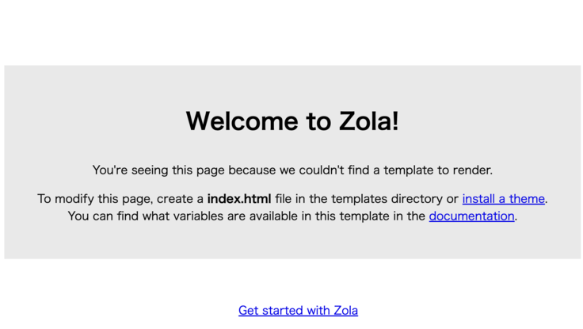
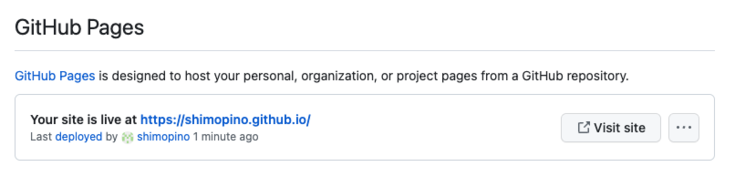
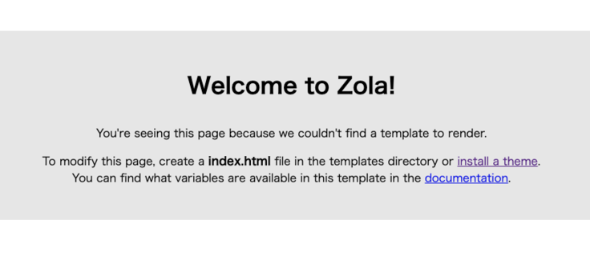
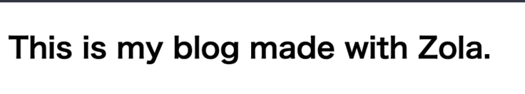
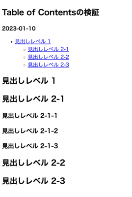
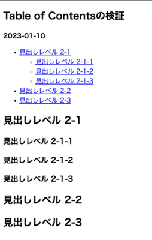

+++
title = "Zolaで始める技術ブログ"
draft = true

[taxonomies]
tags = ["Zola"]
+++

最近 Rust で遊んでいますが、その過程で得た知識を記録していくためにブログを作成することにしました。せっかくなので、ブログには Rust 製の静的サイトジェネレーターである [Zola](https://www.getzola.org/documentation/getting-started/overview/) を使います。

Zola は Jinja2 に似た Tera テンプレートエンジンを使用しており、これから見ていくように動的なテンプレートを通じて、静的な HTML ページに高速に変換することが可能です。

さらに、Zola は Github Pages との連携も簡単に行うことができ、Github Actions を通じて Zola のサイトをビルドし、その結果を Github Pages にデプロイすることが可能です。

今回は Zola を使って技術ブログを構築した手順を残していこうと思います。

```bash
$ zola --version
zola 0.17.2
```

## Zola のセットアップ

公式ドキュメントに記載されている `zola init myblog` コマンドを実行すれば、下記の構造のディレクトリ・ファイルが生成されます。

```bash
├─ config.toml
├─ content
├─ sass
├─ static
├─ templates
└─ themes
```

`config.toml` は Zola の設定ファイルであり、こちらにブログの URL であったり各種設定を行うことが可能です。

ディレクトリはそれぞれ以下の役割が設定されています。

- content
  - Markdown ファイルなどでサイトを構成する記事を管理するディレクトリ
  - 子ディレクトリを作成すればサイトの URL に反映される
- sass
  - コンパイルされる Sass ファイルを配置する
  - Sass 以外のファイルは無視される
  - ディレクトリ構造は保持されるため `sass/something/site.scss` は `public/something/site.css` にコンパイルされる
- static
  - 任意の種類のファイルを配置する
  - このディレクトリ内に配置した構造は、そのまま出力ディレクトリにコピーされる
  - 静的ファイルが大きい場合を考慮して、設定ファイルに `hard_link_static = true` を指定すれば、コピーせずにハードリンクする
- templates
  - レンダリングする時に使用する `Tera` のテンプレートファイルを格納する
  - 構文に従って変数などを指定できる
- themes
  - テーマを利用すると、ここにテンプレートファイル一式が保存される
  - テーマを使用しない場合は空のままにしておく
  - 今回は 1 から作っていくので、このディレクトリは使用しない

初期状態のまま `zola build` を実行すると、下記の外観のサイトが構築されます。



[Overview | Zola](https://www.getzola.org/documentation/getting-started/directory-structure/)

これでブログを始める準備が整いました。

## Github Pages へのデプロイ

私はブログに限らず、ソフトウェアを構築する際には最終的な成果物を完成させてからデプロイするよりも、インクリメンタルに作成していくことが好みです。

まずは Web ページとして閲覧できる状態にするために、今回は Github Actions を使用して、Github Pages にデプロイすることを目指します。

Github Pages では `gh-pages, main, master` というブランチルートに `index.html` を配置してページを公開したり、リポジトリの `docs` ディレクトリから公開することも可能です。

Github Pages の URL は以下のパターンで決まります。

- 特定の名前のリポジトリ
  - リポジトリ名を `<username>.github.io` に設定する
  - これは例えば以下のようなサイトが該当する
    - https://github.com/Yelp/yelp.github.io
- それ以外のリポジトリ
  - `<username>.github.io/<repository>`

[Github Pages について](https://docs.github.com/ja/pages/getting-started-with-github-pages/about-github-pages)

Github Actions 経由でデプロイするには以下の 3 つのステップが必要となります。

1. 他のリポジトリ経由で公開する場合は、そのリポジトリから自身のリポジトリにプッシュするための権限を付与するためのパーソナルアクセストークンを生成する
2. Github Actions を用意する
3. リポジトリ設定の「Github Pages」の項目を設定する

今回はこのリポジトリからサイトを公開するため、PAT の準備はスキップします。

Github Actions は [zola-deploy-action](https://github.com/shalzz/zola-deploy-action) にサンプルが配置されているため、こちらを参考に構築します。

```yml
name: Zola on Github Pages

on:
  push:
    branches:
      - main

jobs:
  build:
    name: Publish Site
    runs-on: ubuntu-latest
    steps:
      - name: Checkout main
        uses: actions/checkout@v3.0.0
      - name: Build and Deploy
        # v0.17.2 では git config --global --add safe.directory '*' に失敗する時があった
        # 最新版の参照する形式に変更
        # https://github.com/shalzz/zola-deploy-action/issues/53#issuecomment-1409707948
        uses: shalzz/zola-deploy-action@master
        env:
          # https://docs.github.com/ja/actions/security-guides/automatic-token-authentication
          GITHUB_TOKEN: ${{ secrets.GITHUB_TOKEN }}
```

Github Actions が実行されると、新しく `gh-pages` ブランチが作成され、そこに `zola build` によって生成された静的ファイルが配置されます。



これでローカルで確認した時と、同じ内容のサイトを構築することができました。



[Github Pages | Deployment | Zola](https://www.getzola.org/documentation/deployment/github-pages/)

## 最初のブログ記事を作成する

### ベースとなるテンプレートファイルを作成する

公式ページの手順に従ってサンプルページを作成していけば、おおよそのテンプレートやコンテンツの挙動を理解することができます。

[Overview | Zola](https://tera.netlify.app/docs/#base-template)

`template` ディレクトリでは、　`Tera` の構文に従ったテンプレートファイルを定義することができ、ここで定義した HTML ファイルを元に様々なページを作成していきます。

以下のように `template/base.html` を作成すれば、 `block` で定義した箇所を child として設定したテンプレートファイルで上書きすることができます。

```jinja2
<!DOCTYPE html>
<html lang="en">
  <head>
    <meta charset="utf-8" />
    <title>MyBlog</title>
  </head>

  <body>
    <section class="section">
      <div class="container">
        
        (* このテンプレートを継承すれば、この部分を上書きすることができる *)
        
      </div>
    </section>
  </body>
</html>
```

### テンプレートファイルを拡張する

child のテンプレートでは親側のテンプレートファイルを拡張し、拡張対象のテンプレートで定義されているブロック `content` を上書きすることが可能です。

`template/index.html` を作成し、以下のように `content` を定義すれば親側の `content` を指定した要素で上書きすることができます。

```jinja2



<h1 class="title">This is my blog made with Zola.</h1>

```



### ブログセクションの作成する

`content` ディレクトリには Markdown ファイルで記述した記事の内容を配置していきます。

```bash
└─ content
        └─ blog
                └─ _index.md
```

Zola ではファイルベースのパスを構築するため、上記の構造でファイルを定義すれば、 `<base_url>/blog` の URL の設定を記述することが可能です。

例えば TOML 形式で以下の設定を記述すれば、対象 URL で使用するテンプレートファイルであったり、個別の記事で使用するテンプレートやページのタイトル、記事のソート順を指定することができます。

```md
+++
title = "List of blog posts"
sort_by = "date"
template = "blog.html"
page_template = "blog-page.html"
+++
```

次にブログのトップページと個別の記事で利用するテンプレートファイルを準備します。

ここでは公式ドキュメントに従い、設定で記述した通りに `template/blog.html` や `template/blog-page.html` を定義してきます。

```jinja2



<h1 class="title">{{ section.title }}</h1>
<ul>
  <!-- section （今回では blog） に配置されているコンテンツを一覧で取得する -->
  
    <!-- pageオブジェクトで個別の設定を使用する -->
    <li>
      <a href="{{ page.permalink | safe }}">{{ page.title }}</a>
    </li>
  
</ul>

```

### ブログコンテンツの作成する

`_index.md` というファイル名は対象のディレクトリに対してセクションの設定を行うことが可能ですが、 `content/blog` ディレクトリにそれ以外のファイル名で記事を作成していくことで、個別の記事のページを作成することが可能です。

今回は最初の記事として `content/blog/first.md` ファイルを作成し、ブログセクションの設定で追加したように `title` と、セクションページで記事をソートするための `date` を設定します。

```md
+++
title = "My first post"
date = 2019-11-27
+++

This is my first blog post.
```

個別の記事に対して、今までと同じように `content` をどのように上書きしていくのかをテンプレートファイルで記述していきます。そのときにコンテンツの内容には `page.content` という変数でアクセスすることが可能です。

```jinja2



  <h1 class="title">{{ page.title }}</h1>
  <p class="subtitle"><strong>{{ page.date }}</strong></p>

  <!-- ここにMarkdownファイルで記述した内容が挿入される -->
  {{ page.content | safe }}

```

ここまで完了すれば、以下のようにセクションページと個別のページが作成されていることが確認できます。なお確認のために `content/blog/second.md` という追加の記事を配置しています。

- セクション: `<base_url>/blog`

  {{ image(src="assets/first-section.png",
           alt="ブログ記事の一覧ページ",
           width="300px") }}

- ページ: `<base_url>/blog/first`

  {{ image(src="assets/first-contents.png",
           alt="ブログ記事のページ",
           width="300px") }}

### トップページにリンクを追加する

現在のトップページにはテキストが配置されているだけですが、 `get_url` 関数を使用すれば直接 `content` ディレクトリへの内部リンクを反映したリンクを取得することが可能です。

`index.html` に以下のようにリンクを設定すればコンテンツへのリンクを設定できます。

```jinja2



  <h1 class="title">This is my blog made with Zola.</h1>

  {# contentに配置したファイル先にリンクを設定することが可能である #}
  <p>
    {# `@` はじまりで他のディレクトリのファイルを指定できる #}
    Click <a href="{{/* get_url(path='@/blog/_index.md') */}}">here</a> to see my
  posts.
  </p>

```

### Github Pages での対応

ローカル開発では記事へのリンクは、開発サーバーが `127.0.0.1/1111` で起動されている場合にはこの URL が使用されますが、Github Pages で利用するためには `config.toml` でドメインの設定が必要になります。

現在は初期化された状態のままであり、以下のように `base_url` が設定されています。

```toml
base_url = "https://example.com"
```

この場合であれば各記事へのリンクは以下のようにこの URL を基準に構築されます。

- `https://example.com/blog/first`

今回は Github Pages を利用するため公開先の URL を設定する必要があります。

```tml
base_url = "https://shimopino.github.io"
```

これで Github Pages で動作するリンクを構築することができ、実際に Web 上で動作するブログを作成することができました。

### 使用した各種構文

- `{{  }}`
  - `expressions` であり各種変数を指定することができる
- ``
  - `statements` であり for ループであったりブロックの設定ができる
- `{{ page.content | safe }}`
  - `|` はパイプライン演算子のように、1 つ前の値を式に代入することが可能である
  - `safe` は指定された値をエスケープ処理することで安全に取り扱うことが可能である
- `get_url`
  - 指定されたパスの `permalink` を取得する
  - 先頭が `@/` で始まる場合は `content` ディレクトリから始める内部リンクとして処理する
  - `static` ファイルを指定することもでき、 `static/css/app.css` を参照したい場合は `get_url("css/app.css")` と指定する

参考資料

- [Basic | Tera](https://tera.netlify.app/docs/#tera-basics)
- [safe | Tera](https://tera.netlify.app/docs/#safe)
- [get_url | Template | Zola](https://www.getzola.org/documentation/templates/overview/#get-url)

## FrontMatter

`content` 以下に配置する `_index.md` は、対象のセクションに表示するコンテンツやメタデータの設定を行うことが可能です。

[FrontMatter | Content | Zola](https://www.getzola.org/documentation/content/section/#front-matter)

例えば以下のような `_index.md` が存在していた場合、これは `<base_url>/blog` 以下のセクションでのコンテンツやメタデータの設定を行うことが可能です。

```bash
└─ content
        └─ blog
                ├─ _index.md
                ├─ entry1.md
                └─ entry2.md
```

この設定は以下のように `+++` で囲まれたファイルの冒頭で宣言することができ、宣言した内容はテンプレートから `section.content` 変数で利用できるようになります。

```toml
# 必要になりそうな変数のみを抽出する。全部確認したいときは公式ドキュメントを参照する。

+++
# htmlの <title> と同じようにタイトルを設定可能
# ここで設定した内容を <head> 要素などに設定してメタ情報を追加できる
title = "Blog Title"

# 各種CLIで `--drafts` を付与したした時にのみ読み込むかどうか
# 下書きなら true にしてビルドされないようにする
draft = false

# コンテンツをどのようにソートするのか指定できる
# ブログOnlyならおおよそ投稿日時とかで良さそう
sort_by = "none"

# 明示的にセクションでどのテンプレートを使用するのか指定できる
# セクションごとにテンプレートを作成しておくのが良さそう
template = "section.html"

# セクションページも検索インデックスに含めるかどうか
in_search_index = true

# セクションのURLにアクセスされた場合のリダイレクト先を決定する
# 例えばセクションに直接アクセスされた時に 404 ページを表示したくない時などに使う
redirect_to =
+++

コンテンツを記述する
```

記事をソートすることもでき、以下のディレクトリ構造であった場合に、`_index.md` の設定に `sort_by = "date"` を設定し、各ページには `date = 2023-04-01` などと設定すれば、記事を日付の降順でソートした状態でテンプレートファイルから参照できます。

```bash
└─ content
        └─ poc
                ├─ _index.md
                ├─ entry1.md
                ├─ entry2.md
                └─ entry3.md
```

今回は `content/poc` 配下のセクションに `draft = true` を設定し、本番のページに対してはビルドされないように検証用専用のページとして配置しています。

## 記事へのタグ付け

### 単純なグルーピング

Zola ではデフォルトで `Taxonomy` というタグ管理の仕組みがサポートされており、事前に定義した Taxonomy のカテゴリに従って、コンテンツをグルーピングすることが可能です。

[Taxonomy | Content | Zola](https://www.getzola.org/documentation/content/taxonomies/)

ビルド時に設定されたタグをもとに、全ての Taxonomy がリストアップされたページを作成し、また各 Taxonomy 名に対応するコンテンツの全てをリストアップしたページを自動的に構築することが可能です。

まずは `config.toml` に対して事前に Taxonomy を定義します。今回は各記事に対して単純に `tags` を定義し、この `tags` に対してそれぞれ `Rust` や `Terraform` などのグルーピングするための値を設定していきます。

```toml
# name = URLで使用される名称。通常は複数形
# paginate_by = ここで指定した値を基準にページネーションを行う
# paginate_path = ページングされた時のページ番号。例えば page/1 のようなURlとなる
# feed = 各タグに対して生成されるFeed（デフォルトでAtomフィードが生成される）
# lang = 多言語対応させたい時に利用する
# render = 対象のタグをレンダリングするかどうか決定する
taxonomies = [
    { name = "tags", feed = true},
]
```

次に各ページに対して、以下のようにタグを設定していきます。

```bash
└─ content
        └─ poc
                ├─ _index.md
                ├─ entry1.md # Rust
                ├─ entry2.md # Terraform
                └─ entry3.md # TypeScript
```

このためには各記事の FrontMatter に対して以下のように設定すればよく、配列なので複数のタグを付与することも可能です。

```md
+++
title = "Entry1"
date = 2023-01-01

[taxonomies]
tags = ["Rust"]
+++

This is date = 2023-01-01
```

これでコンテンツの準備はできましたが、タグの一覧やそれぞれのグループに該当するコンテンツの一覧を表示するためのテンプレートが存在していないため、ビルドすると以下のようなエラーが発生します。

```bash
Error: Failed to build the site
Error: Failed to render a list of tags page.
Error: Reason: Tried to render `taxonomy_list.html` but the template wasn't found
```

Zola では Taxonomy に対して設定した値に基づき、テンプレートディレクトリの以下のファイルを使用して、Taxonomy の一覧やそれぞれの値に対応するページを表示できます。

- `$TAXONOMY_NAME/single.html`
- `$TAXONOMY_NAME/list.html`

[Taxonomy | Templates | Zola](https://www.getzola.org/documentation/templates/taxonomies/)

それぞれのページでは以下の変数を利用することが可能です（全ては載せていません）。

- $TAXONOMY_NAME/single.html
  - `config` Web サイトの設定
  - `taxonomy` 設定した Taxonomy のデータ
  - `terms` 設定された Taxonomy のグルーピングデータ
- $TAXONOMY_NAME/list.html
  - `config` Web サイトの設定
  - `taxonomy` 設定した Taxonomy のデータ
  - `term` 描画されている Taxonomy の値

まずは一覧ページを `templates/tags/list.html` として作成します。

```jinja2



  <div>
    <h1>All Tags</h1>
    <ul>
      {# tags配下に作成しているため、tagsのそれぞれに設定した値を取得できる #}
      
        <li>
          {# それぞれのタグに対応するページへのリンクを設定できる #}
          <a href="{{ term.permalink | safe }}">
            {{ term.name }} ({{ term.pages | length }})
          </a>
        </li>
      
    </ul>
  </div>

```

次に特定のタグに該当するページを `templates/tags/single.html` に作します。

```jinja2



  <div>
    <h1>Tag: #{{ term.name }} ({{ term.pages | length }})</h1>

    <a href="{{ config.base_url | safe }}/tags">Show all tags</a>

    <ul>
      
        <li>
          <a href="{{ page.permalink | safe }}">
            {{ page.title }} 投稿日: ({{ page.date | date(format="%Y-%m-%d") }})
          </a>
        </li>
      
    </ul>
  </div>

```

これで以下のようにタグの一覧ページと個別のページを作成することができました。

- `<base_url>/tags`

  {{ image(src="assets/first-tags-list.png",
           alt="タグの一覧ページ",
           width="300px") }}

- `<base_url>/tags/rust`

  {{ image(src="assets/first-tags-single.png",
           alt="Rustのタグのページ",
           width="300px") }}

### 使用した各種構文

- `{{ term.pages | length }}`
  - 配列、オブジェクト、文字列の要素数を返す
- `{{ page.date | date(format="%Y-%m-%d") }}`
  - タイムスタンプを指定したフォーマットに変換する
  - デフォルトでは `YYYY-MM-DD`
  - タイムゾーンも設定できるが、ブログだと基本的に日付しか使わなそう

参考資料

- [length | Tera](https://tera.netlify.app/docs/#length)
- [date(format) | Tera](https://tera.netlify.app/docs/#date)

## 目次の作成

ページやセクションでは `toc` という目次を表す変数を使用することができ、これは Markdown で記述した見出しを配列として抽出することのできる機能です。

[Table of Contents | Zola](https://www.getzola.org/documentation/content/table-of-contents/)

例えば記事の内容を以下のように記述します。

```md
+++
title = "Table of Contentsの検証"
date = 2023-01-10
+++

# 見出しレベル 1

## 見出しレベル 2-1

### 見出しレベル 2-1-1

### 見出しレベル 2-1-2

### 見出しレベル 2-1-3

## 見出しレベル 2-2

## 見出しレベル 2-3
```

次に各ページのテンプレートを記述している箇所に、以下のように `toc` の変数を通じて各種の見出しレベルを抽出します。

```jinja2
{# 目次を抽出することが可能なときのみHTMLに反映する #}

  <ul>
    {# h1が取れているわけではなく、その記事のトップレベルの見出し要素を取得する #}
    
      <li>
        <a href="{{ h1.permalink | safe }}">{{ h1.title }}</a>

        {# さらに下位の階層の見出しがあればHTMLに書き出す #}
        
          <ul>
            
              <li>
                <a href="{{ h2.permalink | safe }}">{{ h2.title }}</a>
              </li>
            
          </ul>
        

      </li>
    
  </ul>

```

ここでは見出しレベル 2 までの要素で目次が構築されます。



テンプレートで指定している `toc` は必ず見出しレベル 1 のものから抽出されるわけではなく、設定されている Markdown のコンテンツに依存します。

例えば Markdown のファイルの中から見出しレベル 1 の箇所をコメントアウトすれば、以下のように目次が生成されます。



例えばページで 1 つのみ設定する `h1` レベルの見出しに関しては、FrontMatter の `title` 要素で設定を行い、Markdown 形式の記事の中身では `h2` レベル以下の見出ししか使用しない、といったルールを設ければスタイル調整などにも一貫性を持たせることが可能かもしれない。

## スタイルの設定

### Sass を利用する

スタイルの設定は `sass` ディレクトリに Sass ファイルを配置しておけば、CSS ファイルにコンパイルされて同じディレクトリ構造で `public` ディレクトリ以下に配置されます。

```bash
├─ sass
│   ├─ main.scss
│   └─ layout
│          ├─ header.scss
│          └─ footer.scss
└─ public # 同じ構造で以下のようにコンパイルされる
        ├─ main.css
        └─ layout
              ├─ header.css
              └─ footer.css
```

テンプレート側から CSS ファイルを参照する場合には、以下の 2 つの方法があります。

```jinja2
{# ルートディレクトリを指定するパターン #}
{# これは Web サイトのルートディレクトリを指している #}
<link rel="stylesheet" href="/main.css" />

{# `get_url` を指定するパターン #}
{# ファイルへの URL を動的に生成する #}
<link rel="stylesheet" href="{{ get_url(path="main.css", trailing_slash=false) |
safe }}">
```

後者の `get_url` を使用するパターンであれば、Zola の設定ファイルや生成されるファイルの位置に基づいて動作するので、基本的にはこちらを採用します。

なお `public` ディレクトリに全ての Sass ファイルをコンパイルしたくない場合は、アンダーバーをつけて `_header.scss` のようにすれば、依存関係は解決された状態でファイル自体はコンパイルされないように設定できます。

### カスタムフォントの設定

カスタムフォントを設定する場合には、CDN 経由で配信されているフォントファイルをダウンロードする形式と、サーバーに保存されたフォントファイルを配信するパターンがあります。

CDN からフォントファイルを利用する際には、HTML へリンクを追加した後で、CSS でフォントファミリーを指定する必要があります。

```html
<head>
  <link rel="preconnect" href="https://fonts.googleapis.com" />
  <link rel="preconnect" href="https://fonts.gstatic.com" crossorigin />
  <link
    href="https://fonts.googleapis.com/css2?family=Noto+Sans+JP:wght@400;700&display=swap"
    rel="stylesheet"
  />
</head>
```

CSS では以下のようにフォントを指定すれば対応完了です。

```css
body {
  font-family: "Noto Sans JP", sans-serif;
  font-weight: 400;
}
```

サーバーにフォントファイルを配置する場合には `static` ディレクトリにフォントファイルを配置して利用することが可能です。

```bash
├─ static
│   └─ fonts
│           ├─ HackGen-Bold.ttf
│           └─ HackGen-Regular.ttf
└─ public # 同じ構造で以下のようにコンパイルされる
        └─ fonts
                ├─ HackGen-Bold.ttf
                └─ HackGen-Regular.ttf
```

今回はプログラミングフォント 白源（はくげん / HackGen）を利用します。

[HackGen](https://github.com/yuru7/HackGen)

これでコンパイルされることを前提に以下のように Sass ファイルから参照することが可能です。

```css
@font-face {
  font-family: "HackGen";
  src: url("fonts/HackGen-Regular.ttf") format("truetype");
  font-weight: 400;
}

@font-face {
  font-family: "HackGen";
  src: url("fonts/HackGen-Bold.ttf") format("truetype");
  font-weight: 700;
}
```

### ページ全体のテーマカラー設定

直接的には Zola とは関係ない箇所ではありますが、サイトを構築した時の手順として記録を残しておきます。

ページ全体のテーマカラーや背景色、テキストカラーを設定する時には [ColorMagic](https://colormagic.app/) というサービスを利用することができ、指定したキーワードの雰囲気やイメージに合った配色を簡単に作成することができます。

今回は何度か配色生成を行い、このブログサイトの各種カラーを設定しています。

### ページ全体のレイアウト設定

まずはヘッダーやコンテンツ、フッターを含めたページ全体のスタイル調整を行なっていきますが、可能な限りセマンティックな HTML タグを利用してクラスを利用しないスタイリングを採用します。

このクラスレスなスタイリングの方法は [PicoCSS](https://picocss.com/) を参考にしています。

そのために `templates/base.html` のトップレベルのセクションの対して余白調整を行うためのスタイルを設定します。

```jinja2
<div class="container">
  <header></header>
  <main> </main>
  <footer></footer>
</div>
```

今回はブログの横幅などの全体的なスタイルを以下のように設定します。

```css
.container {
  height: 100%;
  max-width: 50rem;
  margin: 0 auto;
}
```

これで左右の余白調整ができた状態となったため、あとはヘッダーやフッターを設定していきます。

将来的にはマクロなどを活用してヘッダーなどの HTML 要素のみを外だしすることも考慮しますが、現時点では複雑な構造を導入せずに直接 `templates/base.html` を編集していきます。

ヘッダーに対しては以下のようにナビゲーションなどの HTML 構造を定義します。

```jinja2
<header>
  <div class="logo">
    <a href="{{ config.base_url }}">Blog</a>
    <span class="cursor"></span>
  </div>
  <nav>
    <a href="/blog" target="_blank" rel="noreferrer noopener">Posts</a>
    <a href="/tags" target="_blank" rel="noreferrer noopener">Tags</a>
    <a href="https://github.com/shimopino" target="_blank" rel="noreferrer noopener">Github</a>
  </nav>
</header>
```

あとはヘッダー自体のレイアウト構造に対して以下のように、ナビゲーションも含めて横並びに設定しておき、後は個別にスタイリングをすれば完了です。

```css
header {
  padding: 2rem;
  display: flex;
  justify-content: space-between;
  align-items: center;
  flex-wrap: wrap;
}
```

フッターには以下のようにシンプルにコピーライトと Zola へのリンクのみを設定します。

```jinja2
<footer>
  <span>© 2023 shimopino. All rights reserved.</span>
  ::
  <span>Made by <a href="https://www.getzola.org/">Zola</a></span>
</footer>
```

## Feed の設定

Zola ではデフォルトで Feed の機能をサポートしており、 `config.toml` ファイルに `generate_feed = true` を設定すれば、サイトの Feed ファイルを作成することができます。

このときに設定で `feed_filename` を設定していればその名前でファイルが生成されますが、指定されていない場合はデフォルトの `atom.xml` が生成されます。

ファイル名には `atom.xml` を指定すれば組み込みの Atom テンプレートで Atom 1.0 形式で生成され、 `rss.xml` を指定すれば組み込みのテンプレートを使用して RSS 2.0 形式で生成され、それ以外のファイル名では自身でテンプレートを用意する必要があります。

```toml
generate_feed = true
feed_filename = "rss.xml"
```

`templates/base.html` ファイルに以下のコードを指定して、記事の自動検出を有効にし、フィードリーダーやブラウザが Web サイトで利用可能な RSS や Atom フィードについて通知できるようにします。

```jinja2

  <link rel="alternate" type="application/rss+xml"
title="RSS" href="{{ get_url(path="rss.xml") | safe }}">

```

画面でリンクを表示させたい場合には、以下のようにリンクを追加するだけで対応できます。

```html
<a href="{{ get_url(path="rss.xml") | safe }}" target="_blank" rel="noreferrer noopener">Feed</a>
```

[Feed | Zola](https://www.getzola.org/documentation/templates/feeds/)

## 404 ページ

どの URL にも該当しない場合に表示する 404 ページは単純に `templates/404.html` を用意すれば、このテンプレートファイルを利用して描画されます。

```jinja2



  <h1>404 Not Found</h1>

```

[404 error page | Zola](https://www.getzola.org/documentation/templates/404/)

## Macros を利用した重複の削除

Zola では Tera のマクロ機能を利用して、重複するコードを関数化させることができます。

例えば以下のように `templates/macros/sample.html` に対して入力された値をベースに `input` 要素を作成する関数を作成します。

```jinja2

  <label>
    {{ label }}
    <input type="{{ type }}" />
  </label>

```

このマクロを利用するには対象のテンプレートファイルから以下のようにインポートし、別名を付与します。

```html

```

あとは付与した別名を元に対象のマクロを呼び出せば処理を実行することができます。

```html
{{ sample_macros::input(label="Name", type="text") }}
```

[macros | Tera](https://tera.netlify.app/docs#macros)

今回は個別のページや記事一覧ページで利用しているタグつけの部分をマクロ化させていくため、以下のように専用のマクロを用意します。

```jinja2

  
    <span>::</span>
    
        
        <a href="{{ tag_url }}">#{{ tag }}</a>&nbsp;
    
  

```

あとはこのマクロを `base.html` で読み込んでおきます。

```html

```

そして `blog.html` や `blog-page.html` でタグを定義している箇所で、このマクロを呼び出せばタグ部分の HTML 箇所を 1 箇所に集約することができます。

```html
{{ tags_macro::tags(page=page) }}
```

他にも記事の目次などは、マクロ化させておくと記事の構造を変更する時に変更箇所がはっきりと理解できるようになります（あまりにも乱用すると処理が分散してしまっていることによる可読性の悪化がひどくなるので注意が必要です）。

## Shortcodes を利用する

Markdown で記述した記事の中に画像への参照が含まれている場合、以下のようにパスや alt テキストを指定するだけで、画像のサイズを設定することができません。

```md

```

こうした場合に Shortcodes の機能を利用すれば、Markdown ファイルから事前に定義された HTML 要素を呼び出すことで、追加の属性などを設定することができます。

[Shortcodes | Zola](https://www.getzola.org/documentation/content/shortcodes/)

まずは `templates/shortcodes/image.html` を作成し、以下のようにテンプレートを作成します。

```jinja2

  

```

あとは Markdown 側でこのファイルを指定して、所定の引数を指定すれば簡易的にスタイルを調整した HTML 要素を記述することが可能です。

```md
{{ image(src="assets/first-section.png",
         alt="sample",
         width="300px") }}
```

これで Markdown 側からも柔軟に HTML 要素を指定することが可能であることがわかりました。

## 感想

触ってみた感じ Zola は薄いライブラリであり、HTML と CSS、ある程度のテンプレート構文を理解できていればそこまでつまづくことなくブログサイトを構築することができました。

マクロや Shortcodes などの乱用すれば運用が難しくなってしまいそうな機能もありますが、必要最小限の利用の留めれば今後も問題なくブログを運用できそうです。

Zola には各種テーマが事前に用意されており、ソースコードも一緒に公開されているので、他のテーマの実装を見ながら挙動確認を進めていくことができたので、こうしたサンプルが豊富に公開されているライブラリは導入が楽で助かりますね。

[Theme | Zola](https://www.getzola.org/themes/)
