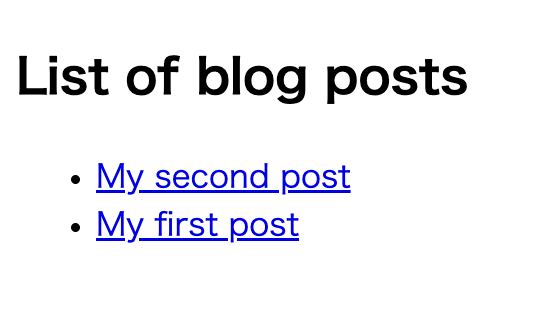

+++
title = "Zolaで始める技術ブログ"
draft = true

[taxonomies]
tags = ["Zola"]
+++

最近 Rust で遊んでいますが、その過程で得た知識を記録していくためにブログを作成することにしました。せっかくなので、ブログには Rust 製の静的サイトジェネレーターである [Zola](https://www.getzola.org/documentation/getting-started/overview/) を使います。

Zola は Jinja2 に似た Tera テンプレートエンジンを使用しており、これから見ていくように動的なテンプレートを通じて、静的な HTML ページに高速に変換することが可能です。

さらに、Zola は Github Pages との連携も簡単に行うことができ、Github Actions を通じて Zola のサイトをビルドし、その結果を Github Pages にデプロイすることが可能です。

今回は Zola を使って技術ブログを構築した手順を残していこうと思います。

```bash
$ zola --version
zola 0.17.2
```

## Zola のセットアップ

公式ドキュメントに記載されている `zola init myblog` コマンドを実行すれば、下記の構造のディレクトリ・ファイルが生成されます。

```bash
├── config.toml
├── content
├── sass
├── static
├── templates
└── themes
```

`config.toml` は Zola の設定ファイルであり、こちらにブログの URL であったり各種設定を行うことが可能です。

ディレクトリはそれぞれ以下の役割が設定されています。

- content
  - Markdown ファイルなどでサイトを構成する記事を管理するディレクトリ
  - 子ディレクトリを作成すればサイトの URL に反映される
- sass
  - コンパイルされる Sass ファイルを配置する
  - Sass 以外のファイルは無視される
  - ディレクトリ構造は保持されるため `sass/something/site.scss` は `public/something/site.css` にコンパイルされる
- static
  - 任意の種類のファイルを配置する
  - このディレクトリ内に配置した構造は、そのまま出力ディレクトリにコピーされる
  - 静的ファイルが大きい場合を考慮して、設定ファイルに `hard_link_static = true` を指定すれば、コピーせずにハードリンクする
- templates
  - レンダリングする時に使用する `Tera` のテンプレートファイルを格納する
  - 構文に従って変数などを指定できる
- themes
  - テーマを利用すると、ここにテンプレートファイル一式が保存される
  - テーマを使用しない場合は空のままにしておく
  - 今回は 1 から作っていくので、このディレクトリは使用しない

初期状態のまま `zola build` を実行すると、下記の外観のサイトが構築されます。


[Overview | Zola](https://www.getzola.org/documentation/getting-started/directory-structure/)

これでブログを始める準備が整いました。

## Github Pages へのデプロイ

私はブログに限らず、ソフトウェアを構築する際には最終的な成果物を完成させてからデプロイするよりも、インクリメンタルに作成していくことが好みです。

まずは Web ページとして閲覧できる状態にするために、今回は Github Actions を使用して、Github Pages にデプロイすることを目指します。

Github Pages では `gh-pages, main, master` というブランチルートに `index.html` を配置してページを公開したり、リポジトリの `docs` ディレクトリから公開することも可能です。

Github Pages の URL は以下のパターンで決まります。

- 特定の名前のリポジトリ
  - リポジトリ名を `<username>.github.io` に設定する
  - これは例えば以下のようなサイトが該当する
    - https://github.com/Yelp/yelp.github.io
- それ以外のリポジトリ
  - `<username>.github.io/<repository>`

[Github Pages について](https://docs.github.com/ja/pages/getting-started-with-github-pages/about-github-pages)

Github Actions 経由でデプロイするには以下の 3 つのステップが必要となります。

1. 他のリポジトリ経由で公開する場合は、そのリポジトリから自身のリポジトリにプッシュするための権限を付与するためのパーソナルアクセストークンを生成する
2. Github Actions を用意する
3. リポジトリ設定の「Github Pages」の項目を設定する

今回はこのリポジトリからサイトを公開するため、PAT の準備はスキップします。

Github Actions は [zola-deploy-action](https://github.com/shalzz/zola-deploy-action) にサンプルが配置されているため、こちらを参考に構築します。

```yml
name: Zola on Github Pages

on:
  push:
    branches:
      - main

jobs:
  build:
    name: Publish Site
    runs-on: ubuntu-latest
    steps:
      - name: Checkout main
        uses: actions/checkout@v3.0.0
      - name: Build and Deploy
        # v0.17.2 では git config --global --add safe.directory '*' に失敗する時があった
        # 最新版の参照する形式に変更
        # https://github.com/shalzz/zola-deploy-action/issues/53#issuecomment-1409707948
        uses: shalzz/zola-deploy-action@master
        env:
          # https://docs.github.com/ja/actions/security-guides/automatic-token-authentication
          GITHUB_TOKEN: ${{ secrets.GITHUB_TOKEN }}
```

Github Actions が実行されると、新しく `gh-pages` ブランチが作成され、そこに `zola build` によって生成された静的ファイルが配置されます。


これでローカルで確認した時と、同じ内容のサイトを構築することができました。


[Github Pages | Deployment | Zola](https://www.getzola.org/documentation/deployment/github-pages/)

## 最初のブログ記事を作成する

### ベースとなるテンプレートファイルを作成する

公式ページの手順に従ってサンプルページを作成していけば、おおよそのテンプレートやコンテンツの挙動を理解することができます。

[Overview | Zola](https://tera.netlify.app/docs/#base-template)

`template` ディレクトリでは、　`Tera` の構文に従ったテンプレートファイルを定義することができ、ここで定義した HTML ファイルを元に様々なページを作成していきます。

以下のように `template/base.html` を作成すれば、 `block` で定義した箇所を child として設定したテンプレートファイルで上書きすることができます。

```jinja2
<!DOCTYPE html>
<html lang="en">
  <head>
    <meta charset="utf-8" />
    <title>MyBlog</title>
  </head>

  <body>
    <section class="section">
      <div class="container">
        
        (* このテンプレートを継承すれば、この部分を上書きすることができる *)
        
      </div>
    </section>
  </body>
</html>
```

### テンプレートファイルを拡張する

child のテンプレートでは親側のテンプレートファイルを拡張し、拡張対象のテンプレートで定義されているブロック `content` を上書きすることが可能です。

`template/index.html` を作成し、以下のように `content` を定義すれば親側の `content` を指定した要素で上書きすることができます。

```jinja2



<h1 class="title">This is my blog made with Zola.</h1>

```


### ブログセクションの作成する

`content` ディレクトリには Markdown ファイルで記述した記事の内容を配置していきます。

```bash
├── content
│   └── blog
│       └── _index.md
```

Zola ではファイルベースのパスを構築するため、上記の構造でファイルを定義すれば、 `<base_url>/blog` の URL の設定を記述することが可能です。

例えば TOML 形式で以下の設定を記述すれば、対象 URL で使用するテンプレートファイルであったり、個別の記事で使用するテンプレートやページのタイトル、記事のソート順を指定することができます。

```md
+++
title = "List of blog posts"
sort_by = "date"
template = "blog.html"
page_template = "blog-page.html"
+++
```

次にブログのトップページと個別の記事で利用するテンプレートファイルを準備します。

ここでは公式ドキュメントに従い、設定で記述した通りに `template/blog.html` や `template/blog-page.html` を定義してきます。

```jinja2



<h1 class="title">{{ section.title }}</h1>
<ul>
  <!-- section （今回では blog） に配置されているコンテンツを一覧で取得する -->
  
    <!-- pageオブジェクトで個別の設定を使用する -->
    <li>
      <a href="{{ page.permalink | safe }}">{{ page.title }}</a>
    </li>
  
</ul>

```

### ブログコンテンツの作成する

`_index.md` というファイル名は対象のディレクトリに対してセクションの設定を行うことが可能ですが、 `content/blog` ディレクトリにそれ以外のファイル名で記事を作成していくことで、個別の記事のページを作成することが可能です。

今回は最初の記事として `content/blog/first.md` ファイルを作成し、ブログセクションの設定で追加したように `title` と、セクションページで記事をソートするための `date` を設定します。

```md
+++
title = "My first post"
date = 2019-11-27
+++

This is my first blog post.
```

個別の記事に対して、今までと同じように `content` をどのように上書きしていくのかをテンプレートファイルで記述していきます。そのときにコンテンツの内容には `page.content` という変数でアクセスすることが可能です。

```jinja2



  <h1 class="title">{{ page.title }}</h1>
  <p class="subtitle"><strong>{{ page.date }}</strong></p>

  <!-- ここにMarkdownファイルで記述した内容が挿入される -->
  {{ page.content | safe }}

```

ここまで完了すれば、以下のようにセクションページと個別のページが作成されていることが確認できます。

- セクション: `<base_url>/blog`

  - 確認のために `content/blog/second.md` という追加の記事を配置しています

  

- ページ: `<base_url>/blog/first`

  

### トップページにリンクを追加する

現在のトップページにはテキストが配置されているだけですが、 `get_url` 関数を使用すれば直接 `content` ディレクトリへの内部リンクを反映したリンクを取得することが可能です。

`index.html` に以下のようにリンクを設定すればコンテンツへのリンクを設定できます。

```jinja2



  <h1 class="title">This is my blog made with Zola.</h1>

  {# contentに配置したファイル先にリンクを設定することが可能である #}
  <p>
    {# `@` はじまりで他のディレクトリのファイルを指定できる #}
    Click <a href="{{/* get_url(path='@/blog/_index.md') */}}">here</a> to see my
  posts.
  </p>

```

### Github Pages での対応

ローカル開発では記事へのリンクは、開発サーバーが `127.0.0.1/1111` で起動されている場合にはこの URL が使用されますが、Github Pages で利用するためには `config.toml` でドメインの設定が必要になります。

現在は初期化された状態のままであり、以下のように `base_url` が設定されています。

```toml
base_url = "https://example.com"
```

この場合であれば各記事へのリンクは以下のようにこの URL を基準に構築されます。

- `https://example.com/blog/first`

今回は Github Pages を利用するため公開先の URL を設定する必要があります。

```tml
base_url = "https://shimopino.github.io"
```

これで Github Pages で動作するリンクを構築することができ、実際に Web 上で動作するブログを作成することができました。

### 使用した各種構文

- `{{  }}`
  - `expressions` であり各種変数を指定することができる
- ``
  - `statements` であり for ループであったりブロックの設定ができる
- `{{ page.content | safe }}`
  - `|` はパイプライン演算子のように、1 つ前の値を式に代入することが可能である
  - `safe` は指定された値をエスケープ処理することで安全に取り扱うことが可能である
- `get_url`
  - 指定されたパスの `permalink` を取得する
  - 先頭が `@/` で始まる場合は `content` ディレクトリから始める内部リンクとして処理する
  - `static` ファイルを指定することもでき、 `static/css/app.css` を参照したい場合は `get_url("css/app.css")` と指定する

参考資料

- [Basic | Tera](https://tera.netlify.app/docs/#tera-basics)
- [safe | Tera](https://tera.netlify.app/docs/#safe)
- [get_url | Template | Zola](https://www.getzola.org/documentation/templates/overview/#get-url)
