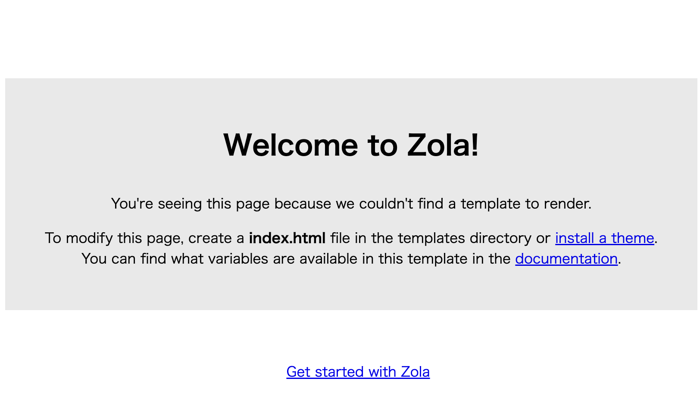

# Zola 事始め

## ディレクトリ構造

公式ドキュメントの記載されている `zola init myblog` コマンドを実行すると、以下の構造のディレクトリ・ファイルが生成される。

```bash
├── config.toml
├── content
├── sass
├── static
├── templates
└── themes
```

`config.toml` は Zola の設定ファイルであり、こちらにブログの URL であったり各種設定を行う必要がある。

ディレクトリはそれぞれ以下の役割が設定されている。

- content
  - Markdown ファイルなどでサイトを構成する記事を管理するディレクトリであり、子ディレクトリを作成すればサイトの URL に反映される。
- sass
  - コンパイルされる Sass ファイルを配置する
  - Sass 以外のファイルは無視される
  - ディレクトリ構造は保持されるため `sass/something/site.scss` は `public/something/site.css` にコンパイルされる
- static
  - 任意の種類のファイルを配置する
  - このディレクトリ内に配置した構造は、そのまま出力ディレクトリにコピーされる
  - 静的ファイルが大きい場合を考慮して、設定ファイルに `hard_link_static = true` を指定すれば、コピーせずにハードリンクする
- templates
  - レンダリングする時に使用する `Tera` のテンプレートファイルを格納する
  - 構文に従って変数などを指定できる
- themes
  - テーマを利用すると、ここにテンプレートファイル一式が保存される
  - テーマを使用しない場合は空のままにしておく

初期状態のまま `zola build` を実行すると、以下のようなサイトが生成される。



https://www.getzola.org/documentation/getting-started/directory-structure/

### 疑問

- CSS ファイルを配置した場合はどうなる？
