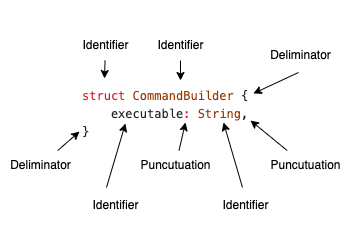
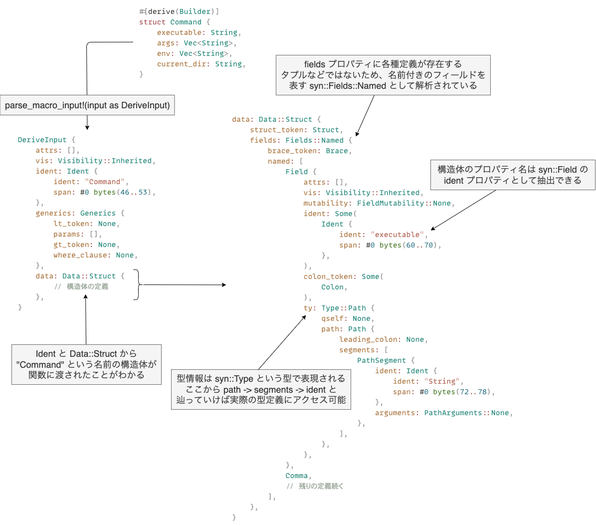
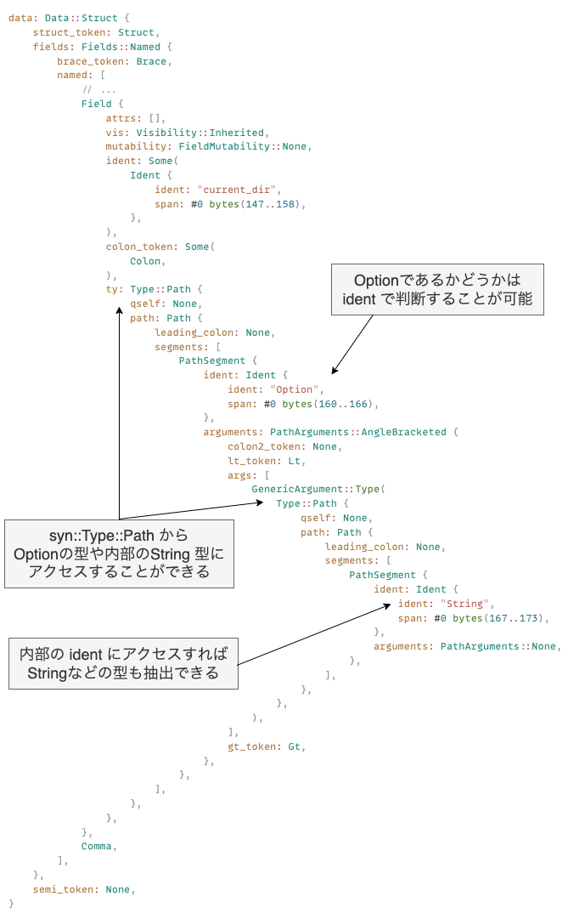
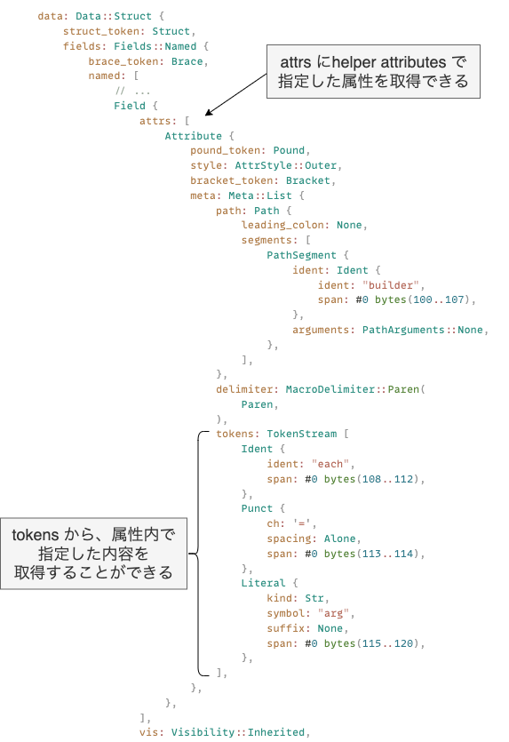
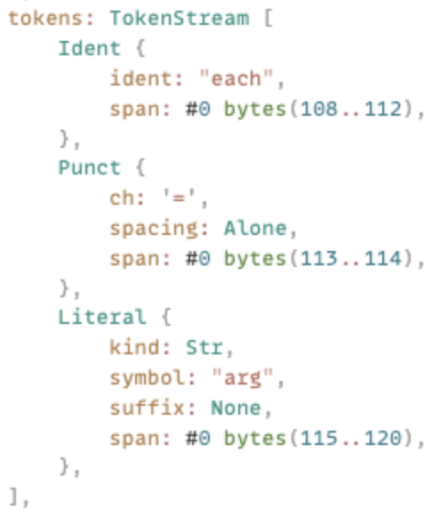
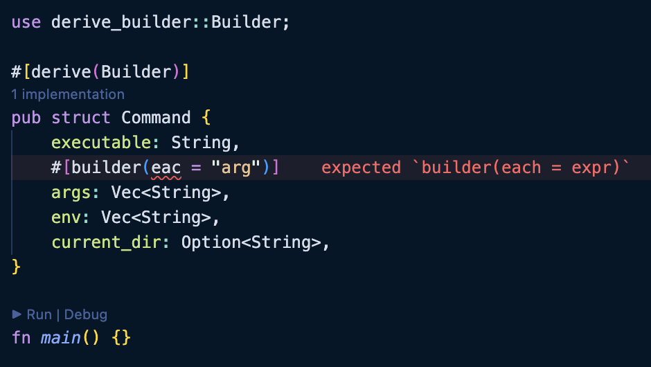

# Rust の手続き的マクロをマスターする

## はじめに

Rust でプログラミングをしていると、 `vec!` や `println!` のような、!で終わる特別な関数を目にすることがあります。これらは、Rust の「マクロ」と呼ばれる機能です。

マクロは、簡単に言うと「コードを生成するコード」のようなものです。これにより、繰り返しや特定のパターンのコードを簡単に、効率的に書くことができます。この記事では、手続きマクロを中心に、 [`proc-macro-workshop`](https://github.com/dtolnay/proc-macro-workshop) という資料を元に学び進めていきます。

## Rust のマクロについて

Rust のマクロには、宣言的マクロと手続き的マクロの 2 つの種類が存在します。

- 宣言的マクロ: これは `macro_rules!` 構文で定義され、 `vec!` や `println!` のようなものがこれに該当します。
- 手続き的マクロ: このマクロの種類には以下の 3 つが含まれます。
  - derive マクロ: `#[derive]` 属性を使ってコードの追加を指定するもの。
  - attribute マクロ: さまざまな要素に適用できるカスタム属性を定義するためのもの。
  - function マクロ: 関数のように、与えられた引数に基づいて動作するマクロ。

本記事では `proc-macro-workshop` を通じて、手続き的マクロの各種類とその記述方法について理解度を深めていきます。

## 進め方

まずは本記事では `#[derive]` マクロを使って Builder パターンの実装を進めていき、最終的には以下のような処理を実現できるようにしていきます。

```rust
use derive_builder::Builder;

#[derive(Builder)]
pub struct Command {
    executable: String,
    #[builder(each = "arg")]
    args: Vec<String>,
    current_dir: Option<String>,
}

fn main() {
    let command = Command::builder()
        .executable("cargo".to_owned())
        .arg("build".to_owned())
        .arg("--release".to_owned())
        .build()
        .unwrap();

    assert_eq!(command.executable, "cargo");
}
```

- [Derive macro: derive(Builder)](https://github.com/dtolnay/proc-macro-workshop/tree/master#derive-macro-derivebuilder)

## 01-parse

まずは一番最初の課題である `01-parse` のテストコードでは、以下の `derive` マクロを利用したときにコンパイルエラーが発生しないようにしていきます。

```rust
#[derive(Builder)]
pub struct Command {
    executable: String,
    args: Vec<String>,
    env: Vec<String>,
    current_dir: String,
}

fn main() {}
```

具体的には初期実装は以下のように `unimplemented!()` が利用されているため、関数の型シグネチャに合うように、空の実装を追加していきます。

```rust
use proc_macro::TokenStream;

#[proc_macro_derive(Builder)]
pub fn derive(input: TokenStream) -> TokenStream {
    let _ = input;

    unimplemented!()
}
```

コンパイルを通すだけであれば空の `TokenStream` を返すために、以下のように空のトークンツリーを生成して返却すれば OK です。

```rust
use proc_macro::TokenStream;

#[proc_macro_derive(Builder)]
pub fn derive(input: TokenStream) -> TokenStream {
    let _ = input;

    TokenStream::new()
}
```

- [proc_macro::TokenStream](https://doc.rust-lang.org/beta/proc_macro/struct.TokenStream.html)

`TokenStream` は Rust コードのトークンのストリームが含まれており、 `Command` 構造体の場合には以下のような内容が入力に含まれている。

```bash
TokenStream [
    Ident {
        ident: "struct",
        span: #0 bytes(39..45),
    },
    Ident {
        ident: "Command",
        span: #0 bytes(46..53),
    },
    Group {
        delimiter: Brace,
        stream: TokenStream [
            Ident {
                ident: "executable",
                span: #0 bytes(60..70),
            },
            Punct {
                ch: ':',
                spacing: Alone,
                span: #0 bytes(70..71),
            },
            Ident {
                ident: "String",
                span: #0 bytes(72..78),
            },
            # ... 残りの定義が続いていく
        ],
        span: #0 bytes(54..151),
    },
]
```

- [TokenStream の全文](https://gist.github.com/shimopino/e896b706c71949203d253ca7edd95b6e)

ただ、これはただのトークンのストリームでしかないため、Rust のソースコードの構文木にパースするための `syn` クレートも用意されている。

今回作成しているものは `derive` マクロであるため、 `syn::DeriveInput` という構造として解析することが可能である。

```rust
#[proc_macro_derive(Builder)]
pub fn derive(input: TokenStream) -> TokenStream {
    let parsed = parse_macro_input!(input as DeriveInput);

    TokenStream::new()
}
```

実際に構文木にパースした結果は以下のようになっており、Rust コードのトークンがツリー構造として変換されており、 `TokenStream` よりも取り扱いしやすい形式になっていることがわかります。

```bash
DeriveInput {
    attrs: [],
    vis: Visibility::Inherited,
    ident: Ident {
        ident: "Command",
        span: #0 bytes(46..53),
    },
    generics: Generics {
        lt_token: None,
        params: [],
        gt_token: None,
        where_clause: None,
    },
    data: Data::Struct {
        struct_token: Struct,
        fields: Fields::Named {
            brace_token: Brace,
            named: [
                Field {
                    attrs: [],
                    vis: Visibility::Inherited,
                    mutability: FieldMutability::None,
                    ident: Some(
                        Ident {
                            ident: "executable",
                            span: #0 bytes(60..70),
                        },
                    ),
                    colon_token: Some(
                        Colon,
                    ),
                    ty: Type::Path {
                        qself: None,
                        path: Path {
                            leading_colon: None,
                            segments: [
                                PathSegment {
                                    ident: Ident {
                                        ident: "String",
                                        span: #0 bytes(72..78),
                                    },
                                    arguments: PathArguments::None,
                                },
                            ],
                        },
                    },
                },
                # ...
            ],
        },
        semi_token: None,
    },
}
```

これでパターンマッチなどと合わせて細かい制御を行うことが可能となりました。

- [syn::DeriveInput](https://docs.rs/syn/latest/syn/struct.DeriveInput.html)
- [Command 構造体の DeriveInput](https://gist.github.com/shimopino/a5cf6c3810b3131b31ba99cc55074d5d)

他にもどのように構文木に解析されるのかが気になる場合は [AST Explorer](https://astexplorer.net/) を実際に触って様々なパターンを見てみるとよいと思います。

## 02-create-builder

次の課題は Builder の derive マクロを適用した構造体に対して、 `builder` メソッドを実装し、Builder パターンを実装するための準備を行います。

```rust
#[derive(Builder)]
pub struct Command {
    executable: String,
    args: Vec<String>,
    env: Vec<String>,
    current_dir: String,
}

fn main() {
    let builder = Command::builder();

    let _ = builder;
}
```

ここでは手続きマクロの内部で以下のような構造体と、その構造体を生成するためのメソッドを作成します。

```rust
pub struct CommandBuilder {
    executable: Option<String>,
    args: Option<Vec<String>>,
    env: Option<Vec<String>>,
    current_dir: Option<String>,
}

impl Command {
    pub fn builder() -> CommandBuilder {
        CommandBuilder {
            executable: None,
            args: None,
            env: None,
            current_dir: None,
        }
    }
}
```

まずは汎用性などは無視してコンパイルエラーが発生しないようにするために、いくつかのフィールドはハードコードでそのまま生成する形式で進める。

手続きマクロの内部で Rust のコードを生成するときには `quote` クレートを利用すると簡単に生成することができる。

```rust
#[proc_macro_derive(Builder)]
pub fn derive(input: TokenStream) -> TokenStream {
    let parsed = parse_macro_input!(input as DeriveInput);

    let expanded = quote! {
        pub struct CommandBuilder {
            executable: Option<String>,
            args: Option<Vec<String>>,
            env: Option<Vec<String>>,
            current_dir: Option<String>,
        }

        impl Command {
            pub fn builder() -> CommandBuilder {
                CommandBuilder {
                    executable: None,
                    args: None,
                    env: None,
                    current_dir: None,
                }
            }
        }
    };

    // ここで TokenStream に型変換している
    expanded.into()
}
```

動作確認のために `cargo expand` を利用すれば、以下のように実際にマクロがどのように展開されているのかがわかり、今回ハードコードで設定した通りにソースコードが生成されていることがわかる。

```rust
#![feature(prelude_import)]
#[prelude_import]
use std::prelude::rust_2021::*;
#[macro_use]
extern crate std;
use demo::Builder;
struct Command {
    executable: String,
    args: Vec<String>,
    env: Vec<String>,
    current_dir: String,
}
pub struct CommandBuilder {
    executable: Option<String>,
    args: Option<Vec<String>>,
    env: Option<Vec<String>>,
    current_dir: Option<String>,
}
impl Command {
    pub fn builder() -> CommandBuilder {
        CommandBuilder {
            executable: None,
            args: None,
            env: None,
            current_dir: None,
        }
    }
}
fn main() {
    let builder = Command::builder();
    let _ = builder;
}
```

これでコンパイルエラーは発生せず、テストも PASS することができたが、ここで急に出てきた `quote` クレートの役割や、他の構造体でも適用できるようにするための汎用化の処理が不足している。

### `quote` クレート

最初の例で見たように、 入力となる `TokenStream` を実際に [ログに出力してみた結果](https://gist.github.com/shimopino/e896b706c71949203d253ca7edd95b6e) を確認すると、Rust のコードを表す値の配列となっていたことがわかる。

```bash
TokenStream [
    Ident {
        ident: "pub",
        span: #5 bytes(29..36),
    },
    Ident {
        ident: "struct",
        span: #5 bytes(29..36),
    },
    # ...
]
```

これは構文木を構成するトークンである `proc_macro::TokenTree` から構成されていることがわかる。

```rust
pub enum TokenTree {
    Group(Group),
    Ident(Ident),
    Punct(Punct),
    Literal(Literal),
}
```

- [proc_macro::TokenTree](https://doc.rust-lang.org/beta/proc_macro/enum.TokenTree.html)

例えば単純に以下のような構造体を追加で定義したいとする。

```rust
struct CommandBuilder {
    executable: String,
}
```

この構造体は `TokenTree` に分解するなら以下のように構成されることとなる。



この場合は `proc_macro::TokenTree` を利用すると以下のように定義することができる

```rust
use proc_macro::{Group, Ident, Punct, Spacing, Span, TokenStream, TokenTree};

#[proc_macro_derive(Builder)]
pub fn derive(input: TokenStream) -> TokenStream {

    // IteratorTokenStream に変換するために
    [
        TokenTree::Ident(Ident::new("struct", Span::call_site())),
        TokenTree::Ident(Ident::new("CommandBuilder", Span::call_site())),
        TokenTree::Group(Group::new(
            proc_macro::Delimiter::Brace,
            [
                TokenTree::Ident(Ident::new("executable", Span::call_site())),
                TokenTree::Punct(Punct::new(':', Spacing::Alone)),
                TokenTree::Ident(Ident::new("String", Span::call_site())),
                TokenTree::Punct(Punct::new(',', Spacing::Alone)),
            ]
            .into_iter()
            .collect::<TokenStream>(),
        )),
    ]
    .into_iter()
    .collect()
}
```

これで `cargo expand` を実行すれば、実際に以下のように設定したトークンに従って、Rust コードが生成されていることがわかる

```rust
struct CommandBuilder {
    executable: String,
}
fn main() {}
```

実は `quote!` はこれと似たようなことをより簡単に実行できるように用意されているクレートであり、実際に Rust のコードを記述すれば、それを `TokenStream` の形式に変換してくれる。

先ほどと同じことを `quote!` で実現したい場合には、以下のように単純に記述すれば、先ほど `TokenTree` を直接利用して記述していた内容と同じことを実現することができる。

```rust
#[proc_macro_derive(Builder)]
pub fn derive(input: TokenStream) -> TokenStream {
    // TokenTree を直接利用するよりも、はるかに簡易的に記述することができる
    let expanded = quote! {
        struct CommandBuilder {
            executable: String,
        }
    }

    // quote! が生成するのはライブラリ用に用意された proc_macto2::TokenStream なのでここで変換する
    expanded.into()
}
```

### Builder 構造体の名前の取得

今回の実装は `Command` 構造体に特化した実装になっていたが、他の構造体やフィールド定義でも利用できるように汎用化させる必要がある。

具体的には Builder パターンの実装に関しては、以下のような構造体名とフィールド定義のパターンが存在していることがわかる。

```rust
// 生成する構造体の名前のパターン [元の構造体の名前]Builder
pub struct CommandBuilder {
    // フィールドの型の定義のパターン [フィールド名]: Option<元の型>,
    executable: Option<String>,
    args: Option<Vec<String>>,
    env: Option<Vec<String>>,
    current_dir: Option<String>,
}
```

つまり `syn` クレートを使用した `DeriveInput` にパースした後で、元の構造体の名前・構造体で定義されている各フィールドの名前と型さえ取得することができれば、汎用的な実装するにすることができる。



- [全体像](https://gist.github.com/shimopino/a5cf6c3810b3131b31ba99cc55074d5d)

まずは構造体の名前を抽出し `[構造体の名前]Builder` という名前の Builder 用の構造体を作成する。

`quote!` 内部では識別子を単純に結合することはできないので、新しく `Ident` を作成して変数として利用する必要があり、以下のように 2 つのやり方が存在しています。

```rust
// quote::format_ident! を利用する方法
let ident = parsed.ident;
let builder_ident = format_ident!("{}Builder", ident);

// syn::Ident::new で直接生成する方法
let ident = parsed.ident;
let builder_name = format!("{}Builder", ident);
let builder_ident = syn::Ident::new(&builder_name, ident.span());

// どちらの場合でも quote! 内で利用できる
quote! {
    struct #builder_ident {
        // ...
    }

    impl #ident {
        pub fn builder() -> #builder_ident {
            #builder_ident {
                // ...
            }
        }
    }
}
```

これでどのような構造体に対して適用しても、対応する Builder 構造体を定義することができます。

- [constructing identifiers](https://docs.rs/quote/latest/quote/macro.quote.html#constructing-identifiers)

### Builder 構造体のフィールドの取得

これまで `quote!` を使って `TokenStream` を定義する際には個別に変数を指定したり、フィールドを指定したりしていたが、このマクロは内部で利用されたイテレータを展開してトークンツリーを組み立てることができる。

```rust
#[proc_macro_derive(Builder)]
pub fn derive(input: TokenStream) -> TokenStream {
    // Iterator の検証のために動的にフィールドを作成するための元データを用意する
    let vars = vec!["a", "b", "c"];

    // 内部で quote! を使用して TokenStream の Iterator を用意する
    let delarations: Vec<proc_macro2::TokenStream> = vars
        .into_iter()
        .map(|var_name| {
            let ident = format_ident!("{}", var_name);
            // TokenStream を生成
            quote! {
                #ident: String,
            }
        })
        .collect();

    let expanded = quote! {
        pub struct Sample {
            // 以下のようにマクロ内で変数を展開するように指定することが可能である
            #(#delarations)*
        }
    };

    expanded.into()
}
```

ここで作成した内容を `cargo expand` で確認すれば、イテレータとして用意した変数を展開して全てのフィールドの定義を動的に作成できていることがわかる。

```rust
pub struct Sample {
    a: String,
    b: String,
    c: String,
}
```

- [quote! での Iterator 展開のテスト](https://github.com/dtolnay/quote/blob/d8cb63f7d7f45c503ac580bd8f3cb2d8bb28b160/tests/test.rs#L79-L87)

`CommandBuilder` の定義と `builder` メソッドの実装を作成する上では、同じように各フィールドや初期値を作成するためのイテレータを用意することを目指す。

```rust
#[proc_macro_derive(Builder)]
pub fn derive(input: TokenStream) -> TokenStream {
    let parsed: DeriveInput = parse_macro_input!(input as DeriveInput);

    let name = parsed.ident;
    let builder_ident = format_ident!("{}Builder", name);

    // 元が構造体であることと、タプルやUnit型を想定していないため、let else で対象データを抽出する
    let syn::Data::Struct(syn::DataStruct { fields: syn::Fields::Named(syn::FieldsNamed { ref named, .. }), .. }) = parsed.data else {
        panic!("This macro can only be applied to struct using named field only, not tuple or unit.");
    };

    // 構造体を構成する各フィールドの定義には Field からアクセスすることが可能
    // Builder の定義と builder メソッドのそれぞれで必要なトークンの形に抽出する
    let builder_fields = named.iter().map(|f| {
        let ident = &f.ident;
        let ty = &f.ty;
        quote! {
            #ident: Option<#ty>
        }
    });

    let builder_init = named.iter().map(|f| {
        let ident = &f.ident;
        quote! {
            #ident: None
        }
    });

    let expanded = quote! {
        pub struct #builder_ident {
            #(#builder_fields,)*
        }

        impl #name {
            pub fn builder() -> #builder_ident {
                #builder_ident {
                    #(#builder_init,)*
                }
            }
        }
    };

    expanded.into()
}
```

これを展開すれば、以下のようにイテレーターが展開されてそれぞれの定義が作成されていることがわかる。

```rust
pub struct CommandBuilder {
    executable: Option<String>,
    args: Option<Vec<String>>,
    env: Option<Vec<String>>,
    current_dir: Option<String>,
}
impl Command {
    pub fn builder() -> CommandBuilder {
        CommandBuilder {
            executable: None,
            args: None,
            env: None,
            current_dir: None,
        }
    }
}
```

これで他の構造体に対しても適用することが可能な汎用的なマクロにすることができました。

## 03-call-setters

次の課題では以下のように `Command` で定義されている各フィールドに対して値を設定するための `setter` を準備します

```rust
#[derive(Builder)]
pub struct Command {
    executable: String,
    args: Vec<String>,
    env: Vec<String>,
    current_dir: String,
}

fn main() {
    let mut builder = Command::builder();
    // フィールドと同じ名称で同じ型を引数に受け取るメソッドを用意する
    builder.executable("cargo".to_owned());
    builder.args(vec!["build".to_owned(), "--release".to_owned()]);
    builder.env(vec![]);
    builder.current_dir("..".to_owned());
}
```

これは構造としては以下のパターンに従うメソッドを作成することと同義です。

```rust
fn [フィールド名](&mut self, [フィールド名]: [フィールドの型]) -> &mut Self {
    self.[フィールド名] = Some([フィールド名])
    self
}
```

前回の課題のときの汎用化の際に適用した実装の大部分を流用するだけで実装することができます。

```rust
let builder_setters = named.iter().map(|f| {
    let ident = &f.ident;
    let ty = &f.ty;
    quote! {
        fn #ident(&mut self, #ident: #ty) -> &mut Self {
            self.#ident = Some(#ident);
            self
        }
    }
});

let expanded = quote! {
    pub struct #builder_ident {
        #(#builder_fields,)*
    }

    impl #builder_ident {
        #(#builder_setters)*
    }

    // ...
};
```

これで以下のように展開すれば指定した通りのメソッドが作成されていることがわかる。

```rust
impl CommandBuilder {
    fn executable(&mut self, executable: String) -> &mut Self {
        self.executable = Some(executable);
        self
    }
    fn args(&mut self, args: Vec<String>) -> &mut Self {
        self.args = Some(args);
        self
    }
    fn env(&mut self, env: Vec<String>) -> &mut Self {
        self.env = Some(env);
        self
    }
    fn current_dir(&mut self, current_dir: String) -> &mut Self {
        self.current_dir = Some(current_dir);
        self
    }
}
```

## 04-call-build

次の課題では以下のように `build` メソッドを作成し、全てのフィールドに値が設定されている場合には `Ok(Command)` を返却し、設定されていないものがあれば `Err` を返却するようにします。

```rust
fn main() {
    let mut builder = Command::builder();
    builder.executable("cargo".to_owned());
    builder.args(vec!["build".to_owned(), "--release".to_owned()]);
    builder.env(vec![]);
    builder.current_dir("..".to_owned());

    // build() メソッドから Result を返却する
    // 設定されていないフィールドがある場合には Err を返却する
    let command = builder.build().unwrap();
    assert_eq!(command.executable, "cargo");
}
```

`Command` のフィールドの場合には、以下のように実装すれば良さそうです。

```rust
impl CommandBuilder {
    fn build(&mut self) -> Result<Command, Box<dyn std::error::Error>> {
        Ok(Command {
            executable: self.executable.take().ok_or("executable is not set")?,
            // ...
        })
    }
}
```

ただしこれはあくまで一例であり、以下のような実装パターンがあります。

1. `&mut self` で参照として受け取り、データを `take` する
   - データを `Command` に移動させながら、ビルダー自体は再利用することができる
   - ビルダー側の値は `None` にリセットされるため、注意して利用する必要がある
2. `&self` で参照として受け取り、データを `clone` する
   - ビルダーには変更されないのでそのまま再利用できる
   - データのコピーが必要であり、パフォーマンスに影響を与える可能性がある

今回は値を移動させるためにするのでパターン 1 で実装します。

```rust
let build_fields = named.iter().map(|f| {
    let ident = &f.ident;
    quote! {
        #ident: self.#ident.take().ok_or(format!("{} is not set", stringify!(#ident)))?
    }
});

let expanded = quote! {
    pub struct #builder_ident {
        // ...
    }

    impl #builder_ident {
        // ...
        fn build(&mut self) -> Result<#ident, Box<dyn std::error::Error>> {
            Ok(#ident {
                #(#build_fields,)*
            })
        }
    }
};
```

これでコンパイルエラーが発生することなくメソッドを追加できました。

## 05-method-chaining

次の課題はメソッドチェーン形式での Builder の利用ではあるが、すでにこれまでの課題が完了していれば問題なくコンパイルできる。

```rust
fn main() {
    let command = Command::builder()
        .executable("cargo".to_owned())
        .args(vec!["build".to_owned(), "--release".to_owned()])
        .env(vec![])
        .current_dir("..".to_owned())
        .build()
        .unwrap();

    assert_eq!(command.executable, "cargo");
}
```

## 06-optional-field

この課題では、構造体に `Option` なフィールドが含まれる場合を想定しており、対象のフィールドに対しては `setter` の呼び出しは必須ではなく、呼び出されていない場合には初期値として `None` がそのまま代入される。

これはフィールドの型を検証して `Option` であることを確認する必要があるため、これまでよりも複雑な処理が必要になります。

```rust
#[derive(Builder)]
pub struct Command {
    executable: String,
    args: Vec<String>,
    env: Vec<String>,
    current_dir: Option<String>, // Optionを含むフィールド定義
}

fn main() {
    let command = Command::builder()
        .executable("cargo".to_owned())
        .args(vec!["build".to_owned(), "--release".to_owned()])
        .env(vec![])
        // current_dir は設定しない場合には None が設定される
        .build()
        .unwrap();
    assert!(command.current_dir.is_none());

    let command = Command::builder()
        .executable("cargo".to_owned())
        .args(vec!["build".to_owned(), "--release".to_owned()])
        .env(vec![])
        // 呼び出した場合には Some(..) が設定される
        // current_dir() は引数として String の値を受け取る
        .current_dir("..".to_owned())
        .build()
        .unwrap();
    assert!(command.current_dir.is_some());
}
```

今の実装では、以下のように `Option` が二重に付与されてしまったり `setter` の引数にも `Option` が付与されてしまいます。

```rust
pub struct CommandBuilder {
    executable: Option<String>,
    args: Option<Vec<String>>,
    env: Option<Vec<String>>,
    current_dir: Option<Option<String>>, // Option<Option<_>> と二重に適用されてしまう
}

impl CommandBuilder {
    // 引数が String ではなく Option<String> になってしまう
    fn current_dir(&mut self, current_dir: Option<String>) -> &mut Self {
        self.current_dir = Some(current_dir);
        self
    }
    // ...
}
```

そこでこの課題では `derive` マクロが適用された構造体に対して、 `Option` が定義されているフィールドの特定と、ラップされている中身の型を抽出して条件分岐的に `TokenStream` を構築していくことを目指します。

方針としては `Field` 内の `syn::Type::Path` からトップレベルの型を抽出し、その型が `Option` であった場合にはさらにラップされている型も同じく `syn::Type::Path` として抽出していきます。



今回は対象が `Option` であった場合には内部の型を取り出して `Some` として返却する関数を用意して、この関数を対象のフィールドが `Option` であるかどうかの判定でも利用します。

```rust
/// Returns unwrapped Type in Option as Option<&Type>
fn unwrap_option(ty: &Type) -> Option<&Type> {
    if let syn::Type::Path(syn::TypePath {
        path: syn::Path { segments, .. },
        ..
    }) = ty
    {
        if segments.len() == 1 {
            if let Some(syn::PathSegment {
                ident,
                arguments:
                    syn::PathArguments::AngleBracketed(syn::AngleBracketedGenericArguments {
                        args, ..
                    }),
            }) = segments.first()
            {
                if ident == "Option" && args.len() == 1 {
                    if let Some(syn::GenericArgument::Type(inner_ty)) = args.first() {
                        return Some(inner_ty);
                    }
                }
            }
        }
    }

    None
}
```

複雑な型構造を順番にアンラップしているので複雑そうに見えますが、やっていることは `Option` の場合には中身の型を `Option<&Type>` で返却しているだけなので割とシンプルです。

後はこの関数を利用して各種 Builder の型定義やメソッドのシグネチャを変更していきます。

まずは Builder の型定義を変更し、対象のフィールドが `Option` の場合は追加の `Option` でラップすることなく、元々の型をそのまま利用します。

```rust
let builder_fields = named.iter().map(|f| {
    let ident = &f.ident;
    let ty = &f.ty;

    if unwrap_option(ty).is_some() {
        quote! {
            #ident: #ty
        }
    } else {
        quote! {
            #ident: Option<#ty>
        }
    }
});
```

これで以下のように元々の構造体のフィールドが `Option` の場合にはそのまま型を利用するようになったことがわかる。

```rust
struct Command {
    executable: String,
    args: Vec<String>,
    env: Vec<String>,
    current_dir: Option<String>,
}

pub struct CommandBuilder {
    executable: Option<String>,
    args: Option<Vec<String>>,
    env: Option<Vec<String>>,
    current_dir: Option<String>, // 二重に Option でラップすることは亡くなった
}
```

同じように各メソッドや、Command の生成部分も条件分岐をさせていきます。

以下は Command を生成する時に代入先のフィールドが `Option` かどうかによって内部の値をアンラップするかどうかを分岐させています。

```rust
let build_fields = named.iter().map(|f| {
    let ident = &f.ident;
    let ty = &f.ty;

    if unwrap_option(ty).is_some() {
        quote! {
            #ident: self.#ident.take()
        }
    } else {
        quote! {
            #ident: self.#ident.take().ok_or(format!("{} is not set", stringify!(#ident)))?
        }
    }
});
```

各 `setter` メソッドの型シグネチャでは、対象のフィールドが `Option` である場合には内部の型を取り出して、その型をメソッドの引数に指定するだけで OK です。

```rust
let builder_setters = named.iter().map(|f| {
    let ident = &f.ident;
    let ty = &f.ty;

    // Option である場合には内部の型を取り出してその型を引数に利用する
    if let Some(inner_ty) = unwrap_option(ty) {
        quote! {
            fn #ident(&mut self, #ident: #inner_ty) -> &mut Self {
                self.#ident = Some(#ident);
                self
            }
        }
    } else {
        quote! {
            fn #ident(&mut self, #ident: #ty) -> &mut Self {
                self.#ident = Some(#ident);
                self
            }
        }
    }
});
```

ここまでできればコンパイルエラーなくテストを実行することが可能になります。

## 07-repeated-field

次の課題ではさらにマクロの機能を深掘りしていき、特定のフィールドに対して属性を付与すると、付与した値を基準に生成されるコードを動的に変更していきます。

また、 `each` で指定した名称がフィールド名と重複している場合には、要素を 1 つ 1 つ登録するメソッドの生成を優先し、 `Option` 型ではないフィールド対するメソッドを呼び出さなかった場合でもデフォルト値を登録するように機能を変更します。

```rust
#[derive(Builder)]
pub struct Command {
    executable: String,
    // フィールドに対して追加の属性を割り当てる
    #[builder(each = "arg")]
    args: Vec<String>,
    // フィールドに対して追加の属性を割り当てる
    #[builder(each = "env")]
    env: Vec<String>,
    current_dir: Option<String>,
}

fn main() {
    let command = Command::builder()
        .executable("cargo".to_owned())
        // 追加した属性に基づいて、Vecを構成する1つ1つの要素を追加していく
        // また、生成されるメソッドも属性で指定した名前で生成される
        .arg("build".to_owned())
        .arg("--release".to_owned())
        .build()
        .unwrap();

    assert_eq!(command.executable, "cargo");
    assert_eq!(command.args, vec!["build", "--release"]);
}
```

このような属性は、公式ドキュメント上では `derive macro helper attributes` と呼ばれており、それ自体はなんらかの処理を行うようなものではなく、マクロに対して追加の情報を送ることでより複雑な処理ができるようにするものです。

- [Derive macro helper attributes](https://doc.rust-lang.org/reference/procedural-macros.html#derive-macro-helper-attributes)

実際にこの属性を付与した状態でマクロを実行すると、1 つ 1 つの属性を構成する `syn::Field` の `attrs` フィールドに以下のような情報が格納されていることがわかる。

```rust
pub struct Field {
    pub attrs: Vec<Attribute>, // 指定した属性が配列として格納されている
    pub vis: Visibility,
    pub mutability: FieldMutability,
    pub ident: Option<Ident>,
    pub colon_token: Option<Colon>,
    pub ty: Type,
}
```



- [syn::Field](https://docs.rs/syn/latest/syn/struct.Field.html)

実装方針としては以下のように進めます

1. 対象のフィールドが `Vec` であるかどうかを検証する
2. `Vec` の場合には `builder` 属性が付与されているかどうかを検証する
3. 属性が付与されている場合には `each` トークンが含まれている中から、適用するメソッド名を抽出する
4. メソッド名の抽出までできれば、各種 `setter` や `build` メソッドで生成するコートを調整する

### フィールドの型の検証を行う関数を拡張する

Command 構造体の各フィールドの型を検証して `Option` の場合には内部の型を `Option<&Type>` として返却する `unwrap_option` 関数を用意していた。

この関数を拡張して、フィールドの型が `Option` である場合には内部の型を返却し、また `Vec` である場合にも内部の型を返却します。また返却する型を `Option<T>` のままにしてしまうとその後で再度条件分岐させる必要があるため、 `Option` や `Vec` やそれ以外の場合も `enum` で表現するようにします。

```rust
enum InnerType {
    OptionType(Type),
    VecType(Type),
    PrimitiveType,
}

fn unwrap_ty(ty: &Type) -> InnerType {
    // ...
}
```

後はこの型に合うように条件分岐させていきます。

```rust
/// Returns InnerType enum with unwrapped Type
fn unwrap_ty(ty: &Type) -> InnerType {
    if let syn::Type::Path(syn::TypePath {
        path: syn::Path { segments, .. },
        ..
    }) = ty
    {
        if segments.len() == 1 {
            if let Some(syn::PathSegment {
                ident,
                arguments:
                    syn::PathArguments::AngleBracketed(syn::AngleBracketedGenericArguments {
                        args, ..
                    }),
            }) = segments.first()
            {
                if args.len() == 1 {
                    if let Some(syn::GenericArgument::Type(inner_ty)) = args.first() {
                        if ident == "Option" {
                            return InnerType::OptionType(inner_ty.clone());
                        } else if ident == "Vec" {
                            return InnerType::VecType(inner_ty.clone());
                        }
                    }
                }
            }
        }
    }

    InnerType::PrimitiveType
}
```

この関数を使用して Builder の各コードを動的に制御していきます。

### TokenStream の解析

`Option` や `Vec` のフィールドであるかどうかの検証はできるようになったため、次は `Vec` であった場合には `derive` マクロの属性から使用するメソッドの名称を抽出する関数を作成します。

ただし、マクロ内で指定した属性は `TokenStream` として得られるため、まずは `TokenStream` をどのように解析すればいいのかを把握します。



まずは `syn` クレートにおける `TokenStream` の解析の仕組みを理解していきます。

- [syn::parse](https://docs.rs/syn/2.0.28/syn/parse/index.html)

`syn` クレートでは `proc_macro2::TokenStream` を解析するために様々な parser 関数を提供しており、 `fn(input: ParseStream) -> syn::Result<Self>` というシグネチャに従って実装することで、トークンを様々な形状として解析することが可能です。

コードで理解するために、まずは以下のように今回解析する対象と同じような `TokenStream` を生成します。

```rust
fn main() {
    let tokens = quote! { each = "arg" }; // proc_macro2::TokenStream
    println!("{:#?}", tokens);
}
```

このコードを実行すれば、画像で示したものと同じ構造の `TokenStream` が生成されていることがわかります。

後はこの構造に従って解析できるように、それぞれのトークンに合致する型を有した構造体を定義し、 `Parse` トレイトを実装していきます。

```rust
// Token! マクロは指定したトークンに合致する構造体に変換する
// 今回の場合は syn::token::Eq に内部では変換している
struct IdentEqualExpr {
    ident: syn::Ident,
    eq_token: syn::Token![=],
    expr: syn::Expr,
}

impl syn::parse::Parse for IdentEqualExpr {
    fn parse(input: syn::parse::ParseStream) -> syn::Result<Self> {
        // 解析する順番に parse を呼び出す
        // 内部でカーソル位置が移動するため、正しい順番で呼び出す必要がある
        let ident = input.parse()?;    // ここで syn::Ident に解析
        let eq_token = input.parse()?; // ここで syn::token::Eq に解析
        let expr = input.parse()?;     // ここで syn::Expr に解析
        Ok(Self {
            ident,
            eq_token,
            expr,
        })
    }
}
```

動作確認のために `proc_macro2::TokenStream` を解析するための `syn::parse2` を実行して結果を確認すると、ストリームから指定した型に正しく解析できていることがわかる。

```rust
fn main() {
    let tokens = quote! { each = "arg" };

    let name_equal_expr = syn::parse2::<IdentEqualExpr>(tokens);

    match name_equal_expr {
        // 出力結果は以下のようになり、指定した通りに解析できていることがわかる
        // 後は Literal を表している syn::LitStr から値を取り出せばよい
        /**
         * IdentEqualExpr {
         *     ident: Ident(
         *         each,
         *     ),
         *     eq_token: Eq,
         *     expr: Expr::Lit {
         *         attrs: [],
         *         lit: Lit::Str {
         *             token: "arg",
         *         },
         *     },
         * }
         */
        Ok(value) => println!("{:#?}", value),
        Err(_) => panic!("unexpected token"),
    }
}
```

`syn` クレートは似たような構造を解析するための型として `syn::MetaNameValue` を用意している。

```rust
pub struct MetaNameValue {
    pub path: Path,
    pub eq_token: Eq,
    pub value: Expr,
}
```

- [syn::MetaNameValue](https://docs.rs/syn/2.0.28/syn/struct.MetaNameValue.html)

最初のフィールドに関しては `syn::Ident` ではなく `syn::Path` として定義されているため利用することができないように思えるが、実は `From` トレイトを以下のように実装しているため、入力が `Ident` であってもこの型を利用して変換することが可能です。

```rust
// https://docs.rs/syn/2.0.28/src/syn/path.rs.html#13-25
impl<T> From<T> for Path
where
    T: Into<PathSegment>,
{
    fn from(segment: T) -> Self {
        let mut path = Path {
            leading_colon: None,
            segments: Punctuated::new(),
        };
        path.segments.push_value(segment.into());
        path
    }
}

// https://docs.rs/syn/latest/src/syn/path.rs.html#96-106
impl<T> From<T> for PathSegment
where
    T: Into<Ident>,
{
    fn from(ident: T) -> Self {
        PathSegment {
            ident: ident.into(),
            arguments: PathArguments::None,
        }
    }
}
```

そのため今回のように `each = "arg"` の構造を解析して、中身の値を取り出す場合には、以下のような実装にしていけばよく、 `Field` には複数の `Attribute` が指定されるため、最初の値のみを取り出して利用する形にします。

```rust
/// unwrap first value from #[builder(each = value)] attribute
fn unwrap_builder_attr_value(attr: &syn::Attribute) -> Option<String> {
    if attr.path().is_ident("builder") {
        if let Ok(syn::MetaNameValue {
            value:
                syn::Expr::Lit(syn::ExprLit {
                    lit: syn::Lit::Str(ref liststr),
                    ..
                }),
            ..
        }) = attr.parse_args::<syn::MetaNameValue>()
        {
            return Some(liststr.value());
        } else {
            return None;
        }
    }

    None
}
```

これで属性の値を取り出す関数は完成です。

### 生成する実装コードの変更

ここまでで Builder を適用した構造体に対して、各フィールドの型を `Vec` や `Option` として解析する方法や、 `builder(each = "arg")` のように付与された属性から `"arg"` という値を取り出すことができるようになった。

後は元々の Builder の実装から以下の箇所を変更していきます。

- build メソッド
  - `Vec` の場合には `None` だった場合に `Vec::new` で初期化
- Builder の各種 `setter` は、 `Vec` の場合には以下条件で実装する
  - `each = expr` の指定がない場合は今まで通りに実装する
  - `each = expr` の指定がある場合
    - フィールド名と重複していない場合は、メソッドを新しく追加する
    - フィールド名と重複している場合は、個別に設定するメソッドを優先する

まずは build メソッドを以下のように変更します。

```rust
let build_fields = named.iter().map(|f| {
    let ident = &f.ident;
    let ty = &f.ty;

    match unwrap_ty(ty) {
        InnerType::OptionType(_) => quote! {
            #ident: self.#ident.take()
        },
        InnerType::VecType(_) => quote! {
            // None でも失敗しないように Vec::new で初期化で対応する
            #ident: self.#ident.take().unwrap_or_else(Vec::new)
        },
        InnerType::PrimitiveType => quote! {
            #ident: self.#ident.take().ok_or(format!("{} is not set", stringify!(#ident)))?
        },
    }
});
```

これで `Vec<T>` として定義されているフィールドに対して `setter` が呼び出されていない場合でも初期値が代入されるようになっています。

次に `setter` メソッドの定義を以下のように変更します。

```rust
// ty の場合も inner_ty の場合も同じ構造なので、依存を引数に移動させて、生成するストリームを制御する
fn generate_default_setter_with(
    ident: &Option<syn::Ident>,
    ty: &syn::Type,
) -> proc_macro2::TokenStream {
    quote! {
        fn #ident(&mut self, #ident: #ty) -> &mut Self {
            self.#ident = Some(#ident);
            self
        }
    }
}

let builder_setters = named.iter().map(|f| {
    let ident = &f.ident;
    let ty = &f.ty;

    match unwrap_ty(ty) {
        InnerType::VecType(inner_ty) => {
            let default_setter = generate_default_setter_with(ident, ty);

            if let Some(each) = unwrap_builder_attr_value(&f.attrs) {
                let each_ident = format_ident!("{}", each);
                let vec_setters = quote! {
                    fn #each_ident(&mut self, #each_ident: #inner_ty) -> &mut Self {
                        if let Some(ref mut values) = self.#ident {
                            values.push(#each_ident);
                        } else {
                            self.#ident = Some(vec![#each_ident]);
                        }
                        self
                    }
                };

                if ident.clone().unwrap() == each_ident {
                    return vec_setters;
                } else {
                    return quote! {
                        #vec_setters
                        #default_setter
                    };
                }
            } else {
                return default_setter;
            }
        }
        InnerType::OptionType(inner_ty) => generate_default_setter_with(ident, &inner_ty),
        InnerType::PrimitiveType => generate_default_setter_with(ident, ty),
    }
});
```

これでコンパイルエラーが発生することなくテストを PASS させることができました。

## 08-unrecognized-attribute

次の課題では、フィールドで使用する属性に意図していない値が指定された場合にユーザーに対してわかりやすいコンパイルエラーを発生させるようにしていきます。

```rust
#[derive(Builder)]
pub struct Command {
    executable: String,
    #[builder(eac = "arg")] // 本当は each を設定しないといけない
    args: Vec<String>,
    env: Vec<String>,
    current_dir: Option<String>,
}
```

テストで利用している `trybuild` ではコンパイルエラー自体のテストも実行することが可能であり、以下のようにテキストとして用意したエラーメッセージを利用してアサーションを行うことが可能です。

```bash
error: expected `builder(each = "...")`
  --> tests/08-unrecognized-attribute.rs:22:7
   |
22 |     #[builder(eac = "arg")]
   |       ^^^^^^^^^^^^^^^^^^^^

```

コンパイルエラーを発生させる方法の 1 つに `compile_error!` マクロが用意されており、手続きマクロでも利用することで間違った指定を行なったユーザーに対してコンパイルエラーを伝えることが可能です。

実装方針としては、今まで `each` という名称を気にせずに値のみを取り出していた下記の処理を変更し、 `each` である `syn::Ident` であるかどうかも検証するように変更します。

```rust
/// unwrap first value from #[builder(each = value)] attribute
fn unwrap_builder_attr_value(attrs: &[syn::Attribute]) -> Option<String> {
    attrs.iter().find_map(|attr| {
        if attr.path().is_ident("builder") {
            if let Ok(syn::MetaNameValue {
                value:
                    syn::Expr::Lit(syn::ExprLit {
                        lit: syn::Lit::Str(ref liststr),
                        ..
                    }),
                ..
            }) = attr.parse_args::<syn::MetaNameValue>()
            {
                return Some(liststr.value());
            } else {
                return None;
            }
        }

        None
    })
}
```

現状の `Option<String>` だと細かい制御ができないため、以下のように `each` が存在した場合とそうではない場合を把握できるようにシグネチャを変更します。

```rust
enum ParseBuilderAttributeResult {
    Valid(String),
    Invalid(syn::Meta),
}
```

後は該当する処理の箇所で `syn::Ident` が `each` であることを検証する処理を追加します。

```rust
/// unwrap first value from #[builder(each = value)] attribute
fn unwrap_builder_attr_value(attrs: &[syn::Attribute]) -> Option<ParseBuilderAttributeResult> {
    attrs.iter().find_map(|attr| {
        if attr.path().is_ident("builder") {
            if let Ok(syn::MetaNameValue {
                value:
                    syn::Expr::Lit(syn::ExprLit {
                        lit: syn::Lit::Str(ref liststr),
                        ..
                    }),
                path,
                ..
            }) = attr.parse_args::<syn::MetaNameValue>()
            {
                // ここで検証する内容と返却値を変更する
                if !path.is_ident("each") {
                    return Some(ParseBuilderAttributeResult::Invalid(attr.meta.clone()));
                }
                return Some(ParseBuilderAttributeResult::Valid(liststr.value()));
            } else {
                return None;
            }
        }

        None
    })
}
```

後は `setter` を生成する際に、以下のように `Invalid` なパターンの場合には `to_compile_error` を利用して `TokenStream` を作成するようにすることで、コンパイルエラーを伝えることができるようになります。

```rust
let builder_setters = named.iter().map(|f| {
    let ident = &f.ident;
    let ty = &f.ty;

    match unwrap_ty(ty) {
        InnerType::VecType(inner_ty) => {
            let default_setter = generate_default_setter_with(ident, ty);

            // ここを Invalid な場合に処理する
            match unwrap_builder_attr_value(&f.attrs) {
                Some(ParseBuilderAttributeResult::Valid(each)) => {
                    let each_ident = format_ident!("{}", each);
                    let vec_setters = quote! {
                        fn #each_ident(&mut self, #each_ident: #inner_ty) -> &mut Self {
                            if let Some(ref mut values) = self.#ident {
                                values.push(#each_ident);
                            } else {
                                self.#ident = Some(vec![#each_ident]);
                            }
                            self
                        }
                    };

                    if ident.clone().unwrap() == each_ident {
                        return vec_setters;
                    } else {
                        return quote! {
                            #vec_setters
                            #default_setter
                        };
                    }
                }
                // TokenStream なので返却する値の型は合うようになっている
                Some(ParseBuilderAttributeResult::Invalid(meta)) => {
                    return syn::Error::new_spanned(meta, "expected `builder(each = \"...\")`")
                        .to_compile_error()
                        .into()
                }
                None => return default_setter,
            };
        }
        InnerType::OptionType(inner_ty) => generate_default_setter_with(ident, &inner_ty),
        InnerType::PrimitiveType => generate_default_setter_with(ident, ty),
    }
});
```

- [to_compile_error](https://docs.rs/syn/1.0.109/syn/struct.Error.html#method.to_compile_error)

これで以下のように間違った値を指定した場合にはコンパイルエラーが発生するようになりました。



## 09-redefined-prelude-type

最後の課題は、ユーザーが独自に定義した型と生成するコード内で使用している型が被ってしまった場合の対応になります。

```rust
type Option = ();
type Some = ();
type None = ();
type Result = ();
type Box = ();

#[derive(Builder)]
pub struct Command {
    executable: String,
}

fn main() {}
```

今までの `cargo expand` を実行した結果から分かるように、マクロはコンパイル時に展開されてRustコードとして実行されます。つまり `quote!` 内で `Result` のように指定している場合には、テストコードのようにユーザー側で `type Result = ()` と内部で使用している型と同じ名称の型を宣言してしまうと、意図していない型が適用されてしまいます。

そこで `quote!` 内で生成するコードに対しては、以下のように名前空間を指定します。

```rust
let expanded = quote! {
    // ...
    impl #builder_ident {
        #(#builder_setters)*

        // Result や Box の名前空間を指定する
        fn build(&mut self) -> std::result::Result<#ident, std::boxed::Box<dyn std::error::Error>> {
            Ok(#ident {
                #(#build_fields,)*
            })
        }
    }
    // ...
};
```

## 追加: 複雑な属性の解析

Builder マクロの作成では以下のように付与された属性を解析して、動的にコードを生成していました。

```rust
#[derive(Builder)]
pub struct Command {
    executable: String,
    #[builder(each = "arg")] // builder という属性で name = expr 形式で指定する
    args: Vec<String>,
    #[builder(each = "env")]　// builder という属性で name = expr 形式で指定する
    env: Vec<String>,
    current_dir: Option<String>,
}
```

サードパーティクレートの中には複雑な解析を行なっているものもあり、その 1 つが [`tracing-attributes`](https://docs.rs/tracing-attributes/0.1.11/tracing_attributes/attr.instrument.html) クレートです。このクレートが提供しているものは derive マクロではなく attributes マクロではありますが、ログ管理のために以下のように複雑な設定を行うことが可能です。

```rust
#[instrument(
    name = "my_name",
    level = "debug",
    target = "my_target",
    skip(non_debug),
    fields(foo="bar", id=1, show=true),
)]
pub fn my_function(arg: usize, non_debug: NonDebug) {
    // ...
}
```

今回は複雑な場合にはどのように解析をしていけばよいのかを理解するために、以下の属性を解析することを目的に進めていきます。なお、元々の課題とは関係ありません。

```rust
fn main() {
    let tokens = quote! {
        name = "sample",
        skip(form, state),
        fields(
            username=name,
        )
    };
}
```

## 感想

- `if-let` を使った値取りだしと条件分岐があまりにも使いやすい

## 疑問点

- [ ] trybuild とは何か？
- [ ] Cargo.toml における test とは何か？
- [ ] 外部クレートを利用せずに実装するには？
- [ ] proc_macro を開発するときの Debugging の設定例
- [ ] rust-analyzer が Bug った時の挙動
  - https://github.com/rust-lang/rust-analyzer/issues/10894
- [ ] span の出力は何か？
- [ ] span の call_site や def_site は何か？
