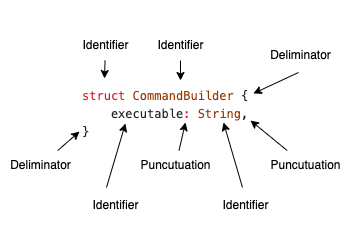
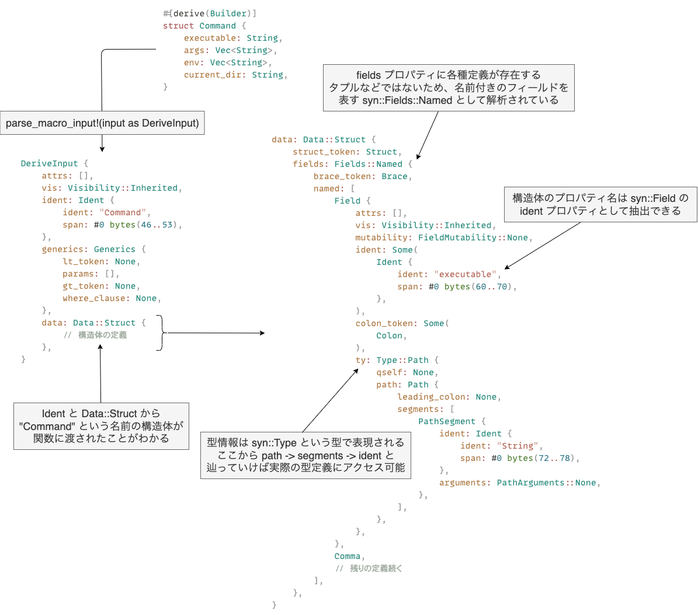

# Rust の手続き的マクロをマスターする

## はじめに

Rust でプログラミングをしていると、 `vec!` や `println!` のような、!で終わる特別な関数を目にすることがあります。これらは、Rust の「マクロ」と呼ばれる機能です。

マクロは、簡単に言うと「コードを生成するコード」のようなものです。これにより、繰り返しや特定のパターンのコードを簡単に、効率的に書くことができます。この記事では、手続きマクロを中心に、 [`proc-macro-workshop`](https://github.com/dtolnay/proc-macro-workshop) という資料を元に学び進めていきます。

## Rust のマクロについて

Rust のマクロには、宣言的マクロと手続き的マクロの 2 つの種類が存在します。

- 宣言的マクロ: これは `macro_rules!` 構文で定義され、 `vec!` や `println!` のようなものがこれに該当します。
- 手続き的マクロ: このマクロの種類には以下の 3 つが含まれます。
  - derive マクロ: `#[derive]` 属性を使ってコードの追加を指定するもの。
  - attribute マクロ: さまざまな要素に適用できるカスタム属性を定義するためのもの。
  - function マクロ: 関数のように、与えられた引数に基づいて動作するマクロ。

本記事では `proc-macro-workshop` を通じて、手続き的マクロの各種類とその記述方法について理解度を深めていきます。

## 進め方

まずは本記事では `#[derive]` マクロを使って Builder パターンの実装を進めていき、最終的には以下のような処理を実現できるようにしていきます。

```rust
use derive_builder::Builder;

#[derive(Builder)]
pub struct Command {
    executable: String,
    #[builder(each = "arg")]
    args: Vec<String>,
    current_dir: Option<String>,
}

fn main() {
    let command = Command::builder()
        .executable("cargo".to_owned())
        .arg("build".to_owned())
        .arg("--release".to_owned())
        .build()
        .unwrap();

    assert_eq!(command.executable, "cargo");
}
```

- [Derive macro: derive(Builder)](https://github.com/dtolnay/proc-macro-workshop/tree/master#derive-macro-derivebuilder)

## 01-parse

まずは一番最初の課題である `01-parse` のテストコードでは、以下の `derive` マクロを利用したときにコンパイルエラーが発生しないようにしていきます。

```rust
#[derive(Builder)]
pub struct Command {
    executable: String,
    args: Vec<String>,
    env: Vec<String>,
    current_dir: String,
}

fn main() {}
```

具体的には初期実装は以下のように `unimplemented!()` が利用されているため、関数の型シグネチャに合うように、空の実装を追加していきます。

```rust
use proc_macro::TokenStream;

#[proc_macro_derive(Builder)]
pub fn derive(input: TokenStream) -> TokenStream {
    let _ = input;

    unimplemented!()
}
```

コンパイルを通すだけであれば空の `TokenStream` を返すために、以下のように空のトークンツリーを生成して返却すれば OK です。

```rust
use proc_macro::TokenStream;

#[proc_macro_derive(Builder)]
pub fn derive(input: TokenStream) -> TokenStream {
    let _ = input;

    TokenStream::new()
}
```

- [proc_macro::TokenStream](https://doc.rust-lang.org/beta/proc_macro/struct.TokenStream.html)

`TokenStream` は Rust コードのトークンのストリームが含まれており、 `Command` 構造体の場合には以下のような内容が入力に含まれている。

```bash
TokenStream [
    Ident {
        ident: "struct",
        span: #0 bytes(39..45),
    },
    Ident {
        ident: "Command",
        span: #0 bytes(46..53),
    },
    Group {
        delimiter: Brace,
        stream: TokenStream [
            Ident {
                ident: "executable",
                span: #0 bytes(60..70),
            },
            Punct {
                ch: ':',
                spacing: Alone,
                span: #0 bytes(70..71),
            },
            Ident {
                ident: "String",
                span: #0 bytes(72..78),
            },
            # ... 残りの定義が続いていく
        ],
        span: #0 bytes(54..151),
    },
]
```

- [TokenStream の全文](https://gist.github.com/shimopino/e896b706c71949203d253ca7edd95b6e)

ただ、これはただのトークンのストリームでしかないため、Rust のソースコードの構文木にパースするための `syn` クレートも用意されている。

今回作成しているものは `derive` マクロであるため、 `syn::DeriveInput` という構造として解析することが可能である。

```rust
#[proc_macro_derive(Builder)]
pub fn derive(input: TokenStream) -> TokenStream {
    let parsed = parse_macro_input!(input as DeriveInput);

    TokenStream::new()
}
```

実際に構文木にパースした結果は以下のようになっており、Rust コードのトークンがツリー構造として変換されており、 `TokenStream` よりも取り扱いしやすい形式になっていることがわかります。

```bash
DeriveInput {
    attrs: [],
    vis: Visibility::Inherited,
    ident: Ident {
        ident: "Command",
        span: #0 bytes(46..53),
    },
    generics: Generics {
        lt_token: None,
        params: [],
        gt_token: None,
        where_clause: None,
    },
    data: Data::Struct {
        struct_token: Struct,
        fields: Fields::Named {
            brace_token: Brace,
            named: [
                Field {
                    attrs: [],
                    vis: Visibility::Inherited,
                    mutability: FieldMutability::None,
                    ident: Some(
                        Ident {
                            ident: "executable",
                            span: #0 bytes(60..70),
                        },
                    ),
                    colon_token: Some(
                        Colon,
                    ),
                    ty: Type::Path {
                        qself: None,
                        path: Path {
                            leading_colon: None,
                            segments: [
                                PathSegment {
                                    ident: Ident {
                                        ident: "String",
                                        span: #0 bytes(72..78),
                                    },
                                    arguments: PathArguments::None,
                                },
                            ],
                        },
                    },
                },
                # ...
            ],
        },
        semi_token: None,
    },
}
```

これでパターンマッチなどと合わせて細かい制御を行うことが可能となりました。

- [syn::DeriveInput](https://docs.rs/syn/latest/syn/struct.DeriveInput.html)
- [Command 構造体の DeriveInput](https://gist.github.com/shimopino/a5cf6c3810b3131b31ba99cc55074d5d)

他にもどのように構文木に解析されるのかが気になる場合は [AST Explorer](https://astexplorer.net/) を実際に触って様々なパターンを見てみるとよいと思います。

## 02-create-builder

次の課題は Builder の derive マクロを適用した構造体に対して、 `builder` メソッドを実装し、Builder パターンを実装するための準備を行います。

```rust
#[derive(Builder)]
pub struct Command {
    executable: String,
    args: Vec<String>,
    env: Vec<String>,
    current_dir: String,
}

fn main() {
    let builder = Command::builder();

    let _ = builder;
}
```

ここでは手続きマクロの内部で以下のような構造体と、その構造体を生成するためのメソッドを作成します。

```rust
pub struct CommandBuilder {
    executable: Option<String>,
    args: Option<Vec<String>>,
    env: Option<Vec<String>>,
    current_dir: Option<String>,
}

impl Command {
    pub fn builder() -> CommandBuilder {
        CommandBuilder {
            executable: None,
            args: None,
            env: None,
            current_dir: None,
        }
    }
}
```

まずは汎用性などは無視してコンパイルエラーが発生しないようにするために、いくつかのプロパティはハードコードでそのまま生成する形式で進める。

手続きマクロの内部で Rust のコードを生成するときには `quote` クレートを利用すると簡単に生成することができる。

```rust
#[proc_macro_derive(Builder)]
pub fn derive(input: TokenStream) -> TokenStream {
    let parsed = parse_macro_input!(input as DeriveInput);

    let expanded = quote! {
        pub struct CommandBuilder {
            executable: Option<String>,
            args: Option<Vec<String>>,
            env: Option<Vec<String>>,
            current_dir: Option<String>,
        }

        impl Command {
            pub fn builder() -> CommandBuilder {
                CommandBuilder {
                    executable: None,
                    args: None,
                    env: None,
                    current_dir: None,
                }
            }
        }
    };

    // ここで TokenStream に型変換している
    expanded.into()
}
```

動作確認のために `cargo expand` を利用すれば、以下のように実際にマクロがどのように展開されているのかがわかり、今回ハードコードで設定した通りにソースコードが生成されていることがわかる。

```rust
#![feature(prelude_import)]
#[prelude_import]
use std::prelude::rust_2021::*;
#[macro_use]
extern crate std;
use demo::Builder;
struct Command {
    executable: String,
    args: Vec<String>,
    env: Vec<String>,
    current_dir: String,
}
pub struct CommandBuilder {
    executable: Option<String>,
    args: Option<Vec<String>>,
    env: Option<Vec<String>>,
    current_dir: Option<String>,
}
impl Command {
    pub fn builder() -> CommandBuilder {
        CommandBuilder {
            executable: None,
            args: None,
            env: None,
            current_dir: None,
        }
    }
}
fn main() {
    let builder = Command::builder();
    let _ = builder;
}
```

これでコンパイルエラーは発生せず、テストも PASS することができたが、ここで急に出てきた `quote` クレートの役割や、他の構造体でも適用できるようにするための汎用化の処理が不足している。

### `quote` クレート

最初の例で見たように、 入力となる `TokenStream` を実際に [ログに出力してみた結果](https://gist.github.com/shimopino/e896b706c71949203d253ca7edd95b6e) を確認すると、Rust のコードを表す値の配列となっていたことがわかる。

```bash
TokenStream [
    Ident {
        ident: "pub",
        span: #5 bytes(29..36),
    },
    Ident {
        ident: "struct",
        span: #5 bytes(29..36),
    },
    # ...
]
```

これは構文木を構成するトークンである `proc_macro::TokenTree` から構成されていることがわかる。

```rust
pub enum TokenTree {
    Group(Group),
    Ident(Ident),
    Punct(Punct),
    Literal(Literal),
}
```

- [proc_macro::TokenTree](https://doc.rust-lang.org/beta/proc_macro/enum.TokenTree.html)

例えば単純に以下のような構造体を追加で定義したいとする。

```rust
struct CommandBuilder {
    executable: String,
}
```

この構造体は `TokenTree` に分解するなら以下のように構成されることとなる。



この場合は `proc_macro::TokenTree` を利用すると以下のように定義することができる

```rust
use proc_macro::{Group, Ident, Punct, Spacing, Span, TokenStream, TokenTree};

#[proc_macro_derive(Builder)]
pub fn derive(input: TokenStream) -> TokenStream {

    // IteratorTokenStream に変換するために
    [
        TokenTree::Ident(Ident::new("struct", Span::call_site())),
        TokenTree::Ident(Ident::new("CommandBuilder", Span::call_site())),
        TokenTree::Group(Group::new(
            proc_macro::Delimiter::Brace,
            [
                TokenTree::Ident(Ident::new("executable", Span::call_site())),
                TokenTree::Punct(Punct::new(':', Spacing::Alone)),
                TokenTree::Ident(Ident::new("String", Span::call_site())),
                TokenTree::Punct(Punct::new(',', Spacing::Alone)),
            ]
            .into_iter()
            .collect::<TokenStream>(),
        )),
    ]
    .into_iter()
    .collect()
}
```

これで `cargo expand` を実行すれば、実際に以下のように設定したトークンに従って、Rust コードが生成されていることがわかる

```rust
struct CommandBuilder {
    executable: String,
}
fn main() {}
```

実は `quote!` はこれと似たようなことをより簡単に実行できるように用意されているクレートであり、実際に Rust のコードを記述すれば、それを `TokenStream` の形式に変換してくれる。

先ほどと同じことを `quote!` で実現したい場合には、以下のように単純に記述すれば、先ほど `TokenTree` を直接利用して記述していた内容と同じことを実現することができる。

```rust
#[proc_macro_derive(Builder)]
pub fn derive(input: TokenStream) -> TokenStream {
    // TokenTree を直接利用するよりも、はるかに簡易的に記述することができる
    let expanded = quote! {
        struct CommandBuilder {
            executable: String,
        }
    }

    // quote! が生成するのはライブラリ用に用意された proc_macto2::TokenStream なのでここで変換する
    expanded.into()
}
```

### 汎用化

今回の実装は `Command` 構造体に特化した実装になっていたが、他の構造体やプロパティ定義でも利用できるように汎用化させる必要がある。

具体的には Builder パターンの実装に関しては、以下のような構造体名とプロパティ定義のパターンが存在していることがわかる。

```rust
// 生成する構造体の名前のパターン [元の構造体の名前]Builder
pub struct CommandBuilder {
    // プロパティの型の定義のパターン [プロパティ名]: Option<元の型>,
    executable: Option<String>,
    args: Option<Vec<String>>,
    env: Option<Vec<String>>,
    current_dir: Option<String>,
}
```

つまり `syn` クレートを使用した `DeriveInput` にパースした後で、元の構造体の名前・構造体で定義されている各プロパティの名前と型さえ取得することができれば、汎用的な実装するにすることができる。



- [全体像](https://gist.github.com/shimopino/a5cf6c3810b3131b31ba99cc55074d5d)

まずは構造体の名前を抽出し `[構造体の名前]Builder` という名前の Builder 用の構造体を作成する。

`quote!` 内部では識別子を単純に結合することはできないので、新しく `Ident` を作成して変数として利用する必要があり、以下のように 2 つのやり方が存在しています。

```rust
// quote::format_ident! を利用する方法
let ident = parsed.ident;
let builder_ident = format_ident!("{}Builder", ident);

// syn::Ident::new で直接生成する方法
let ident = parsed.ident;
let builder_name = format!("{}Builder", ident);
let builder_ident = syn::Ident::new(&builder_name, ident.span());

// どちらの場合でも quote! 内で利用できる
quote! {
    struct #builder_ident {
        // ...
    }
}
```

これでどのような構造体に対して適用しても、対応する Builder 構造体を定義することができます。

- [constructing identifiers](https://docs.rs/quote/latest/quote/macro.quote.html#constructing-identifiers)

## 疑問点

- [ ] trybuild とは何か？
- [ ] Cargo.toml における test とは何か？
- [ ] 外部クレートを利用せずに実装するには？
- [ ] proc_macro を開発するときの Debugging の設定例
- [ ] rust-analyzer が Bug った時の挙動
  - https://github.com/rust-lang/rust-analyzer/issues/10894
- [ ] syn::Ident の役割は何か
- [ ] format_ident!() マクロは何か？
- [ ] cargo expand するとどのような内容が出力されるのか？
- [ ] span の出力は何か？
- [ ] span の call_site や def_site は何か？
- [ ] #fields を quote!内で利用した時にどのように展開されるのか？
- [ ] syn の parse_macro_input を使わなかった場合の出力は何か？
- [ ] Option の clone と take の違いは何か？
