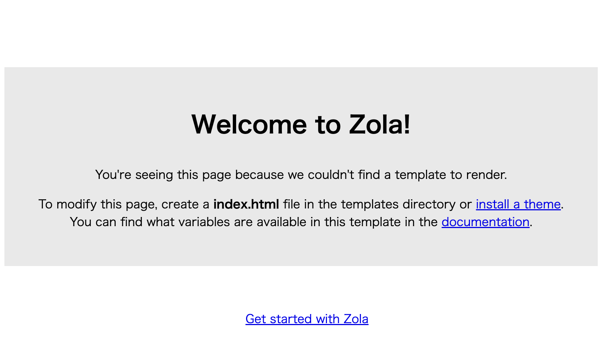
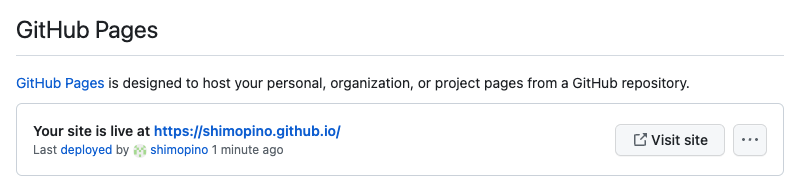
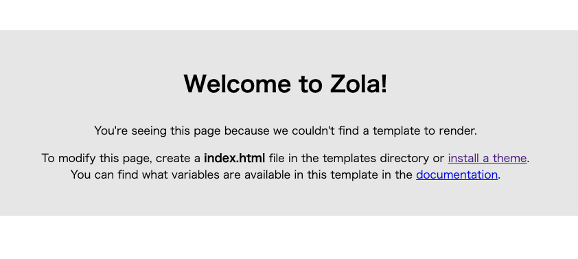
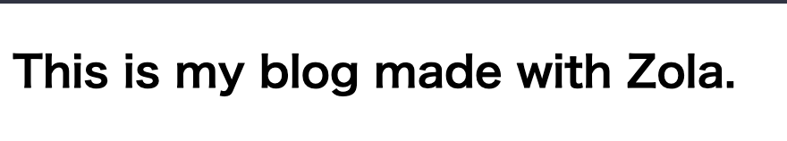
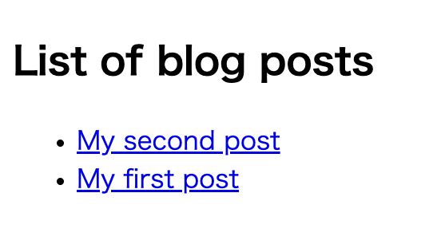
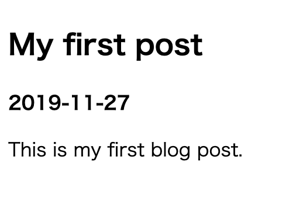
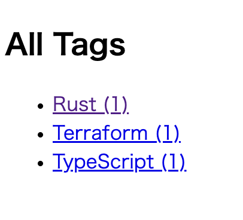
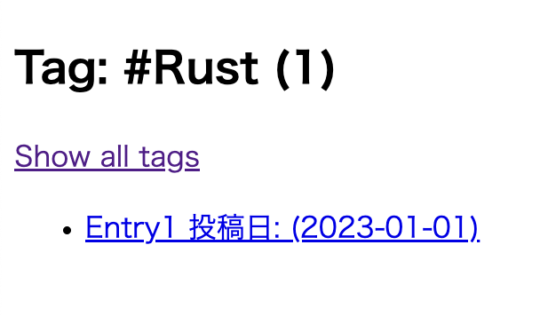
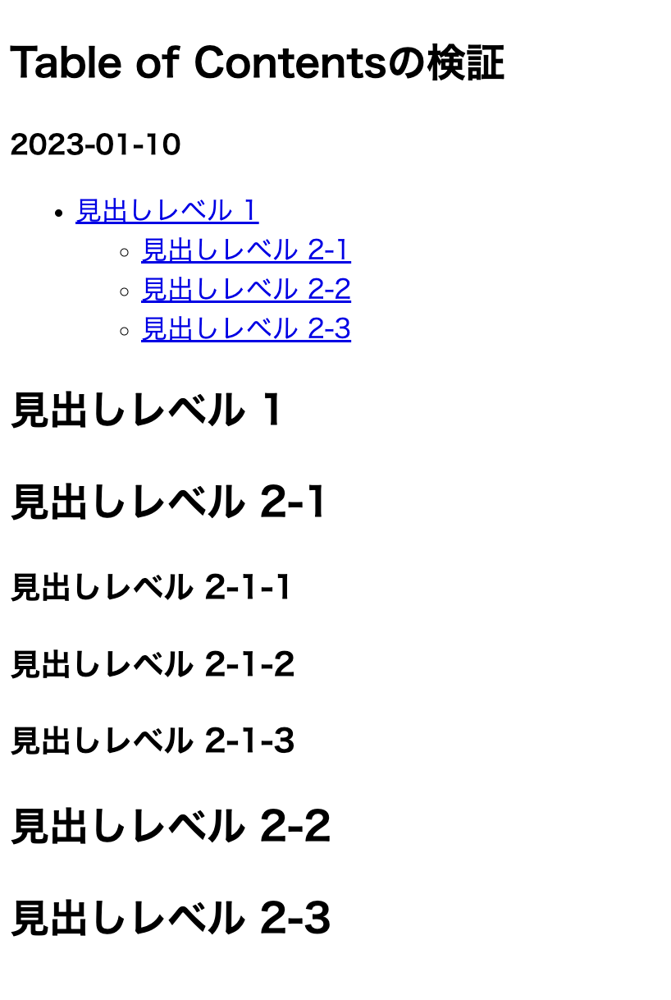
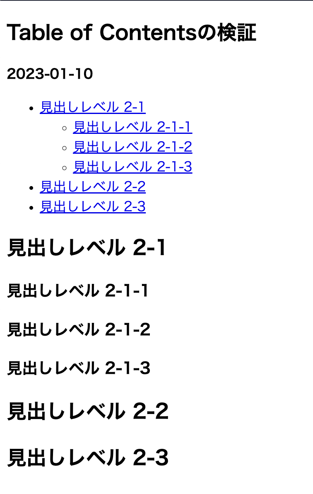

# Zola 事始め

- [Zola 事始め](#zola-事始め)
  - [ディレクトリ構造](#ディレクトリ構造)
    - [疑問](#疑問)
  - [Github Pages へのデプロイ](#github-pages-へのデプロイ)
    - [疑問点](#疑問点)
  - [最初のページ作成](#最初のページ作成)
    - [親のテンプレートファイルを作成](#親のテンプレートファイルを作成)
    - [子側のテンプレートファイルで上書きする](#子側のテンプレートファイルで上書きする)
    - [ブログセクションの作成](#ブログセクションの作成)
    - [ブログコンテンツの作成](#ブログコンテンツの作成)
    - [トップページにリンクを追加](#トップページにリンクを追加)
    - [Github Pages での対応](#github-pages-での対応)
    - [使用した各種構文](#使用した各種構文)
  - [Front Matter](#front-matter)
    - [疑問点](#疑問点-1)
  - [記事へのタグ付け](#記事へのタグ付け)
    - [単純なグルーピング](#単純なグルーピング)
    - [使用した各種構文](#使用した各種構文-1)
  - [シンタックスハイライト](#シンタックスハイライト)
  - [目次](#目次)

## ディレクトリ構造

公式ドキュメントの記載されている `zola init myblog` コマンドを実行すると、以下の構造のディレクトリ・ファイルが生成される。

```bash
├── config.toml
├── content
├── sass
├── static
├── templates
└── themes
```

`config.toml` は Zola の設定ファイルであり、こちらにブログの URL であったり各種設定を行う必要がある。

ディレクトリはそれぞれ以下の役割が設定されている。

- content
  - Markdown ファイルなどでサイトを構成する記事を管理するディレクトリであり、子ディレクトリを作成すればサイトの URL に反映される。
- sass
  - コンパイルされる Sass ファイルを配置する
  - Sass 以外のファイルは無視される
  - ディレクトリ構造は保持されるため `sass/something/site.scss` は `public/something/site.css` にコンパイルされる
- static
  - 任意の種類のファイルを配置する
  - このディレクトリ内に配置した構造は、そのまま出力ディレクトリにコピーされる
  - 静的ファイルが大きい場合を考慮して、設定ファイルに `hard_link_static = true` を指定すれば、コピーせずにハードリンクする
- templates
  - レンダリングする時に使用する `Tera` のテンプレートファイルを格納する
  - 構文に従って変数などを指定できる
- themes
  - テーマを利用すると、ここにテンプレートファイル一式が保存される
  - テーマを使用しない場合は空のままにしておく

初期状態のまま `zola build` を実行すると、以下のようなサイトが生成される。



- https://www.getzola.org/documentation/getting-started/directory-structure/

### 疑問

- CSS ファイルを配置した場合はどうなる？

## Github Pages へのデプロイ

ブログを始めるにあたり、最終的な成果物を完成させてからデプロイするよりも、インクリメンタルに作成していくことが個人的な好みなので、まずは Web ページとして閲覧できる状態にする。

今回は Github Actions を使用して、Github Pages にデプロイすることを目指す。

Github Pages では `gh-pages, main, master` というブランチルートに `index.html` を配置して生成ファイルを公開したり、リポジトリの `docs` ディレクトリから公開することも可能である。

Github Pages の URL は以下のパターンで決まる。

- 特定の名前のリポジトリ

  - リポジトリ名を `<username>.github.io` に設定する
  - これは例えば以下のようなサイトが該当する
    - https://github.com/Yelp/yelp.github.io

- それ以外のリポジトリ
  - `<username>.github.io/<repository>`

`zola` を使用する場合は、スタイルをサブモジュールとして含めるようにすればうまく動作するらしい

```bash
git submodule add https://github.com/getzola/after-dark.git themes/after-dark
```

- https://docs.github.com/ja/pages/getting-started-with-github-pages/about-github-pages

Github Actions 経由でデプロイするには以下の 3 つのステップが必要となる。

1. もしも他のリポジトリから公開する場合は、そのリポジトリから自身のリポジトリにプッシュするための権限を付与するためのパーソナルアクセストークンを生成する
2. Github Actions を用意する
3. リポジトリ設定の「Github Pages」の項目を設定する

今回はこのリポジトリからサイトを公開するため、PAT の準備はスキップする。

Github Actions は [zola-deploy-action](https://github.com/shalzz/zola-deploy-action) の公式サンプルにならって構築する。

```yml
name: Zola on Github Pages

on:
  push:
    branches:
      - main

jobs:
  build:
    name: Publish Site
    runs-on: ubuntu-latest
    steps:
      - name: Checkout main
        uses: actions/checkout@v3.0.0
      - name: Build and Deploy
        uses: shalzz/zola-deploy-action@v0.17.2
        env:
          # https://docs.github.com/ja/actions/security-guides/automatic-token-authentication
          GITHUB_TOKEN: ${{ secrets.GITHUB_TOKEN }}
```

この Github Actions が実行されると、新しく `gh-pages` ブランチが作成され、そこに `zola build` によって生成された静的ファイルが配置される。



これでローカルで初期化した後でビルドした時と同じサイトを構築することができる。



- https://www.getzola.org/documentation/deployment/github-pages/

### 疑問点

サブモジュールによるスタイル適用の仕組みは何か？

## 最初のページ作成

### 親のテンプレートファイルを作成

公式ページの手順に従ってサンプルページを作成していく。

`template` ディレクトリでは、　`Tera` の構文に従ったテンプレートファイルを定義することができ、ここで定義した HTML ファイルを元に様々なページを作成していく。

以下のように `template/base.html` を作成すれば、 `block` で定義した箇所を child として設定したファイルで上書きすることが可能となる。

```html
<!DOCTYPE html>
<html lang="en">
  <head>
    <meta charset="utf-8" />
    <title>MyBlog</title>
  </head>

  <body>
    <section class="section">
      <div class="container"> </div>
    </section>
  </body>
</html>
```

```html
 
<h1 class="title">This is my blog made with Zola.</h1>

```

- https://tera.netlify.app/docs/#base-template

### 子側のテンプレートファイルで上書きする

子側のテンプレートファイルでは、拡張対象のテンプレートで定義されているブロック `content` を上書きすることができる。

`template/index.html` を作成し、以下のように `content` を定義すれば親側の `content` を指定した要素で上書きすることができる。

```html


<!-- 以下に上書きするブロック content を記述していく -->


<h1 class="title">This is my blog made with Zola.</h1>

```



### ブログセクションの作成

`content` ディレクトリに Markdown ファイルで記事の内容を記述していく。

```bash
├── content
│   └── blog
│       └── _index.md
```

上記の構造でファイルを定義すれば、 `<path>/blog` の URL の設定を記述することが可能となる。

例えば TOML 形式で以下の設定を記述すれば、対象 URL で使用するテンプレートファイルであったり、個別の記事で使用するテンプレートやページのタイトル、記事のソート順を指定することができる。

```md
+++
title = "List of blog posts"
sort_by = "date"
template = "blog.html"
page_template = "blog-page.html"
+++
```

次にブログのトップページと個別の記事で利用するテンプレートファイルを準備する。

ここでは設定で記述した通りに `template/blog.html` や `template/blog-page.html` を定義していく。

```html


<!-- 以下で content をどのように上書きするのか記載していく -->


<h1 class="title">{{ section.title }}</h1>
<ul>
  <!-- section （今回では blog） に配置されているコンテンツを一覧で取得する -->
  
  <!-- pageオブジェクトで個別の設定を使用する -->
  <li><a href="{{ page.permalink | safe }}">{{ page.title }}</a></li>
  
</ul>

```

### ブログコンテンツの作成

`content/blog` ディレクトリ以下に個別の記事の内容を作成していく。

今回はブログセクションの設定で追加したように `title` と、セクションページで記事をソートするための `date` を設定する。

```md
+++
title = "My first post"
date = 2019-11-27
+++

This is my first blog post.
```

個別の記事に対して、今までと同じように `content` をどのように上書きしていくのかをテンプレートファイルで記述していく。そのときにコンテンツの内容には `page.content` でアクセすることができる。

```html


<!-- 以下に個別の記事の content を定義する -->


<h1 class="title">{{ page.title }}</h1>
<p class="subtitle"><strong>{{ page.date }}</strong></p>
<!-- ここにMarkdownファイルで記述した内容が挿入される -->
{{ page.content | safe }}
<!--  -->

```

同じようなコンテンツファイルを配置すれば、以下のようにセクションファイルと個別のページを作成することができている状態となる。

- セクション: `<url>/blog`

  

- ページ: `<url>/blog/first`

  

### トップページにリンクを追加

トップページには何もリンクがないが、 `get_url` 関数を使用すれば直接 `content` ディレクトリへの内部リンクを指定したリンクを取得することが可能である。

`index.html` に以下のようにリンクを設定すればコンテンツへのリンクを設定できる。

```html


<!-- 以下に上書きするブロック content を記述していく -->


<h1 class="title">This is my blog made with Zola.</h1>
<!-- contentに配置したファイル先にリンクを設定することが可能である -->
<p>
  Click <a href="{{ get_url(path='@/blog/_index.md') }}">here</a> to see my
  posts.
</p>

```

### Github Pages での対応

ローカル開発では記事へのリンクは、開発サーバーが `127.0.0.1/1111` で起動されている場合にはこの URL が使用されるが、Github Pages で利用するためには `config.toml` でドメインの設定が必要となる。

現在は以下のように `base_url` を設定している。

```tml
base_url = "https://example.com"
```

この場合であれば各記事へのリンクは以下のようにこの URL を基準に構築される。

- `https://example.com/blog/first`

今回は Github Pages を利用するため以下の URL を設定する。

```tml
base_url = "https://shimopino.github.io"
```

これで Github Pages での動作するリンクを構築することができる。

### 使用した各種構文

- `{{  }}`
  - `expressions` であり各種変数を指定することができる
- ``
  - `statements` であり for ループであったりブロックの設定ができる
- `{{ page.content | safe }}`
  - `|` はパイプライン演算子のように、1 つ前の値を式に代入することが可能である
  - `safe` は指定された値をエスケープ処理することで安全に取り扱うことが可能である
- `get_url`

  - 指定されたパスの `permalink` を取得する
  - 先頭が `@/` で始める場合は `content` ディレクトリから始める内部リンクとして処理する
  - `static` ファイルを指定することもでき、 `static/css/app.css` を参照したい場合は `get_url("css/app.css")` と指定する

参考資料

- [Tera Basic](https://tera.netlify.app/docs/#tera-basics)
- [safe](https://tera.netlify.app/docs/#safe)
- [get_url](https://www.getzola.org/documentation/templates/overview/#get-url)

## Front Matter

`content` 以下に配置する `_index.md` は、対象のセクションに表示するコンテンツやメタデータの設定を行うことができる。

例えば以下のような `_index.md` が存在していた場合、これは `base_url/blogs` 以下のセクションでのコンテンツやメタデータの設定を行うことが可能である。

```bash
└──content
    └── blogs
        ├── _index.md
        ├── entry1.md
        └── entry2.md
```

この設定は以下のように `+++` で囲まれたファイルの冒頭で宣言することができ、宣言した内容はテンプレートから `section.content` 変数で利用できるようになる。

以下に使う可能性がありそうなものだけを抽出する。

```toml
+++
# htmlの <title> と同じようにタイトルを設定可能
title = "Blog Title"

# 各種CLIで `--drafts` を付与したした時にのみ読み込むかどうか
# 下書きなら true にしてビルドされないようにすれば良さそう
draft = false

# コンテンツをどのようにソートするのか指定できる
# ブログOnlyならおおよそ投稿日時とかで良さそう
sort_by = "none"

# 明示的にセクションでどのテンプレートを使用するのか指定できる
# セクションごとにテンプレートを作成しておくのが良さそう
template = "section.html"

# セクションページも検索インデックスに含めるかどうか
in_search_index = true

# セクションのURLにアクセスされた場合のリダイレクト先を決定する
# 例えばセクションに直接アクセスされた時に 404 ページを表示したくない時などに使う
redirect_to =
+++

コンテンツを記述可能
```

記事をソートすることもでき、以下のディレクトリ構造出会った場合に、`_index.md` の設定に `sort_by = "date"` を設定し、各ページには `date = 2023-04-01` などと設定すればその順番でソートされる。

```bash
└──content
    └── poc
        ├── _index.md
        ├── entry1.md
        ├── entry2.md
        └── entry3.md
```

今回は `content/poc` 配下のセクションに `draft = true` を設定し、本番のページに対してはビルドされないように検証用専用のページとして配置している。

- https://www.getzola.org/documentation/content/section/#front-matter

### 疑問点

- draft の挙動認識が合っているの

## 記事へのタグ付け

### 単純なグルーピング

Zola ではデフォルトで `Taxonomy` というタグ管理の仕組みがサポートされており、事前に定義した Taxonomy のカテゴリに従って、コンテンツをグルーピングすることが可能である。

Zola では、ビルド時に設定されたタグをもとに、全ての Taxonomy がリストアップされたページを作成し、また各 Taxonomy 名に対応するコンテンツの全てをリストアップしたページを作成できる。

まずは `config.toml` に対して事前に Taxonomy を定義する。今回は各記事に対して単純に `tags` を定義し、この `tags` に対してそれぞれ `Rust` や `Terraform` などのグルーピングするための値を設定していく。

```toml
# name = URLで使用される名称。通常は複数形
# paginate_by = ここで指定した値を基準にページネーションを行う
# paginate_path = ページングされた時のページ番号。例えば page/1 のようなURlとなる
# feed = 各タグに対して生成されるFeed（デフォルトでAtomフィードが生成される）
# lang = 多言語対応させたい時に利用する
# render = 対象のタグをレンダリングするかどうか決定する
taxonomies = [
    { name = "tags", feed = true},
]
```

後は各ページにタグを設定していけば良いが、以下のようにタグ付けをしていく。

```bash
└──content
    └── poc
        ├── _index.md
        ├── entry1.md # Rust
        ├── entry2.md # Terraform
        └── entry3.md # TypeScript
```

このためには FrontMatter に対して以下のように設定すれば良い。配列なので複数のタグを付与することも可能である。

```md
+++
title = "Entry1"
date = 2023-01-01

[taxonomies]
tags = ["Rust"]
+++

This is date = 2023-01-01
```

これでコンテンツの準備はできたが、タグの一覧やそれぞれのグループに該当するコンテンツの一覧を表示するためのテンプレートが存在していた眼、ビルドすると以下のようなエラーが発生する。

```bash
Error: Failed to build the site
Error: Failed to render a list of tags page.
Error: Reason: Tried to render `taxonomy_list.html` but the template wasn't found
```

- https://www.getzola.org/documentation/content/taxonomies/
- https://www.getzola.org/documentation/templates/taxonomies/

Zola では Taxonomy に対して設定した値に基づき、テンプレートディレクトリの以下のファイルをを使用して、Taxonomy の一覧やそれぞれの値に対応するページを表示できる。

- `$TAXONOMY_NAME/single.html`
- `$TAXONOMY_NAME/list.html`

それぞれのページでは以下の変数を利用することが可能である（全ては載せていない）。

- $TAXONOMY_NAME/single.html
  - `config` Web サイトの設定
  - `taxonomy` 設定した Taxonomy のデータ
  - `terms` 設定された Taxonomy のグルーピングデータ
- $TAXONOMY_NAME/list.html
  - `config` Web サイトの設定
  - `taxonomy` 設定した Taxonomy のデータ
  - `term` 描画されている Taxonomy の値

まずは一覧ページを `templates/tags/list.html` として作成する。

```html


<!-- 以下に上書きするブロック content を記述していく -->


<div>
  <h1>All Tags</h1>
  <ul>
    
    <li>
      <a href="{{ term.permalink | safe }}">
        {{ term.name }} ({{ term.pages | length }})
      </a>
    </li>
    
  </ul>
</div>

```

次に特定のタグに該当するページを `templates/tags/single.html` に作成する。

```html


<!-- 以下に上書きするブロック content を記述していく -->


<div>
  <h1>Tag: #{{ term.name }} ({{ term.pages | length }})</h1>

  <a href="{{ config.base_url | safe }}/tags"> Show all tags </a>

  <ul>
    
    <li>
      <a href="{{ page.permalink | safe }}">
        {{ page.title }} 投稿日: ({{ page.date | date(format="%Y-%m-%d") }})
      </a>
    </li>
    
  </ul>
</div>

```

これで以下のようにタグの一覧ページと個別のページを作成することができた。

- `base_url/tags`

  

- `base_url/tags/rust`

  

### 使用した各種構文

- `{{ term.pages | length }}`
  - 配列、オブジェクト、文字列の要素数を返す
- `{{ page.date | date(format="%Y-%m-%d") }}`
  - タイムスタンプを指定したフォーマットに変換する
  - デフォルトでは `YYYY-MM-DD`
  - タイムゾーンも設定できるが、ブログだと基本的に日付しか使わなそう

参考資料

- [length](https://tera.netlify.app/docs/#length)
- [date(format)](https://tera.netlify.app/docs/#date)

## シンタックスハイライト

Zola で組み込みでいくつかのシンタックスハイライトのスタイルが提供されている。

https://www.getzola.org/documentation/getting-started/configuration/#syntax-highlighting

上記で定義されているテーマを設定ファイルに指定すればシンタックスハイライトを有効にした状態でコードを表示することが可能となる。

```toml
[markdown]
highlight_code = true
highlight_theme = "base16-ocean-dark"
```

以下のように Markdown 形式でコードを記述する。

```rs
fn main() {
    println!("Hello World");
}
```

これだけで以下のようにシンタックスハイライトを有効にすることができる。


## 目次

ページやセクションでは `toc` という目次を表す変数を使用することができ、これは Markdown で記述した見出しを配列として抽出することのできる機能である。

例えば `content` を以下のように設定する。

```md
+++
title = "Table of Contentsの検証"
date = 2023-01-10
+++

# 見出しレベル 1

## 見出しレベル 2-1

### 見出しレベル 2-1-1

### 見出しレベル 2-1-2

### 見出しレベル 2-1-3

## 見出しレベル 2-2

## 見出しレベル 2-3
```

次に各ページのテンプレートを記述している箇所に、以下のように `toc` の変数を通じて各種の見出しレベルを抽出することができる。

```html

<ul>
  
  <li>
    <a href="{{ h1.permalink | safe }}">{{ h1.title }}</a>
    
    <ul>
      
      <li>
        <a href="{{ h2.permalink | safe }}">{{ h2.title }}</a>
      </li>
      
    </ul>
    
  </li>
  
</ul>

```

ここでは見出しレベル 2 までの要素で目次が構築される。



テンプレートで指定している `toc` は必ず見出しレベル 1 のものから抽出されるわけではなく、設定されている Markdown のコンテンツに依存する。

例えば Markdown のファイルの中から見出しレベル 1 の箇所をコメントアウトすれば、以下のように目次が生成されることがわかる。



こうして設定した目次に対してスタイリングを行えば十分見やすい目次に変更することが可能である。
